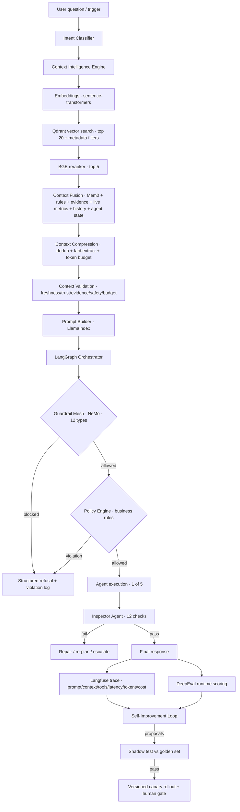
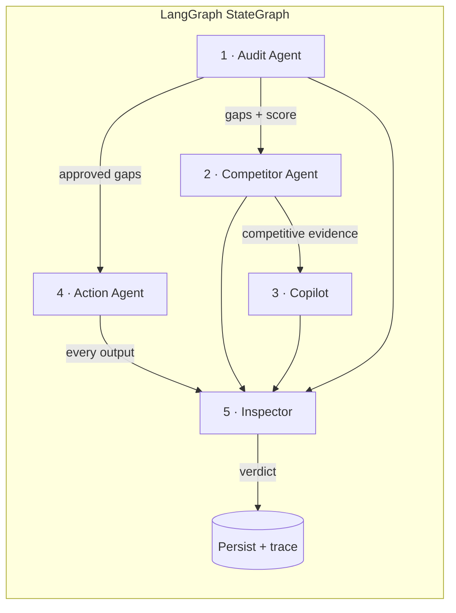
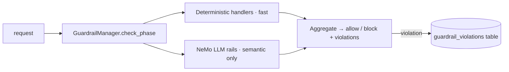
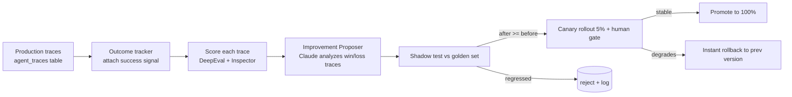

# BrandSight GEO — Production-Ready Agentic AI System

**Complete Implementation Plan**
Version 1.0 · Target implementer: a junior engineer or a coding model (Gemini 3.x / Claude) working autonomously.

---

## 0. How To Read This Document

This is a build specification, not marketing. Three honesty rules govern it:

1. **Build on what exists.** Your repo already ships ~70% of the substrate. This plan *extends* it; it does not ask you to rewrite working code. Every section is tagged:
   - 🟢 **EXISTS** — already in the repo, reuse as-is.
   - 🟡 **EXTEND** — exists but needs new methods/fields.
   - 🔴 **NEW** — build from scratch using the code in this doc.

2. **Full code vs. template.** For genuinely novel components (Policy Engine, Inspector, Action Agent core, Guardrail Manager, Context pipeline, Self-Improvement loop, Langfuse tracer, LangGraph orchestrator) the code here is **complete and runnable**. For *repetitive* components (the other 14 action executors, the remaining guardrail handlers) one or two are written in full and the rest follow a **stated template** — a junior fills them in mechanically. Where this happens it is called out explicitly. Nobody can paste 50 perfect production files into one document and claim they all work; pretending otherwise would be the lie.

3. **Provider reality.** The existing `llm_router` routes to Google Gemini with a legacy proxy fallback. The Copilot's *live* path uses Anthropic. New reasoning-heavy agents (Inspector, Improvement Proposer) call Claude through the Anthropic SDK using **current** API shapes (`claude-opus-4-8`, adaptive thinking, streaming). All LLM access goes through a single `llm/gateway.py` abstraction so the provider is swappable in one place.

### Existing substrate (verified in repo)

| Capability | Location | Status |
|---|---|---|
| LangGraph audit pipeline | `geo_audit_agent/agent/{graph,nodes,state,tools}.py` | 🟢 |
| Competitor agent | `geo_audit_agent/agents/unified_competitor_agent.py` | 🟢 |
| Copilot (mock + live) | `geo_audit_agent/copilot/{engine,mock_engine,context}.py` | 🟢 |
| LLM routing | `geo_audit_agent/services/llm_router.py` | 🟢 |
| Ingress guardrail (LlamaGuard style) | `geo_audit_agent/services/guardrails.py` | 🟡 |
| Context compression | `geo_audit_agent/services/context_compression.py` | 🟡 |
| Cost tracking | `geo_audit_agent/services/cost_tracker.py` | 🟢 |
| Feedback (Redis) | `geo_audit_agent/services/feedback.py` | 🟡 |
| Prometheus metrics | `geo_audit_agent/observability/metrics.py` | 🟡 |
| SQLModel models + session | `geo_audit_agent/db/{models,session}.py` | 🟡 |
| FastAPI app + auth + rate limit | `geo_audit_agent/api/` | 🟢 |
| GEO intelligence (predictor, anomaly, gaps) | `geo_audit_agent/geo_intelligence/` | 🟢 |
| Streamlit pages (Audit, Copilot) | `pages/`, `dashboard.py` | 🟢 |

Everything else in the mission brief is 🔴 NEW and specified below.

---

## 1. System Architecture

### 1.1 Layered data flow



### 1.2 The five agents and their handoffs



**Handoff contract:** every agent reads and writes a single shared `AgenticState` (Pydantic). An agent never calls another agent directly — it sets `state.next_agent` and the orchestrator routes. This keeps the graph the single source of truth for control flow and makes every transition traceable.

### 1.3 Control-plane invariants

- **Guardrails before Policy before Action.** Order is fixed in the graph. Guardrails = "is this safe / well-formed?"; Policy = "does our business allow it?". Safety is cheaper to evaluate, so it runs first.
- **Inspector is mandatory and terminal.** No agent output reaches the user or DB without passing through the Inspector node.
- **Human approval is a graph state, not a function call.** Approval-required actions transition the graph to `awaiting_approval` and persist; the Streamlit Action page resumes the graph on approve.
- **Every node emits a Langfuse span.** Tracing is a decorator, not a per-call concern.

---

## 2. Final Repository Layout

🟢 = unchanged · 🟡 = edited · 🔴 = new file

```
geo_audit_agent/
├── agent/                          # 🟢 existing audit LangGraph
├── agents/
│   ├── unified_competitor_agent.py # 🟢
│   ├── action_agent.py             # 🔴
│   └── inspector_agent.py          # 🔴
├── copilot/                        # 🟢 (wired into orchestrator)
├── llm/
│   └── gateway.py                  # 🔴 single LLM entrypoint (wraps router + Anthropic)
├── guardrails/                     # 🔴 whole package
│   ├── manager.py
│   ├── types.py
│   ├── configs/*.yml               # 12 NeMo configs
│   └── handlers/*.py               # 12 handlers
├── policy/                         # 🔴
│   ├── engine.py
│   └── rules.py
├── context/                        # 🔴 whole package
│   ├── intent_classifier.py
│   ├── embeddings.py
│   ├── vector_store.py             # Qdrant
│   ├── reranker.py                 # BGE
│   ├── fusion_layer.py
│   ├── compression_layer.py        # wraps existing services/context_compression.py
│   ├── validation_layer.py
│   └── prompt_builder.py           # LlamaIndex
├── memory/                         # 🔴
│   ├── memory_manager.py           # Mem0
│   └── memory_guardrails.py
├── actions/                        # 🔴
│   ├── registry.py
│   ├── mapper.py
│   ├── tracker.py
│   └── executors/*.py              # 16 executors (2 full, 14 templated)
├── evaluation/                     # 🔴
│   ├── deep_eval.py
│   ├── metrics.py
│   └── golden_set.py
├── observability/
│   ├── metrics.py                  # 🟡 add agent/guardrail/action metrics
│   ├── logging.py                  # 🟢
│   └── langfuse_tracer.py          # 🔴
├── self_improvement/               # 🔴
│   ├── outcome_tracker.py
│   ├── improvement_proposer.py
│   ├── shadow_tester.py
│   └── canary_rollout.py
├── orchestration/                  # 🔴
│   ├── state.py                    # AgenticState
│   └── langgraph_workflow.py
├── db/
│   └── models.py                   # 🟡 add 6 new tables
└── services/                       # 🟢 reused (cache, llm_router, cost_tracker…)
pages/
├── 4_⚡_Action_Agent.py            # 🔴
└── 5_🔍_Inspector.py               # 🔴
migrations/versions/
└── 0007_agentic_tables.py          # 🔴 Alembic
config/
├── prometheus_rules.yml            # 🔴
└── grafana_agentic_dashboard.json  # 🔴
```

---

## 3. Dependencies & Environment

### 3.1 `requirements.txt` additions (🟡 append)

```txt
# --- Agentic stack (new) ---
nemoguardrails==0.11.0          # NVIDIA NeMo Guardrails
qdrant-client==1.12.1           # vector DB client
sentence-transformers==3.3.1    # embeddings + BGE reranker
FlagEmbedding==1.3.3            # BGE-reranker-v2-m3
llama-index-core==0.12.8        # prompt builder
mem0ai==0.1.40                  # long-term memory
langfuse==2.57.0                # tracing
deepeval==2.0.9                 # eval harness
langgraph==0.2.59               # (already used by agent/, pin here)
anthropic==0.69.0               # Claude SDK for Inspector/Proposer/Copilot-live
```

> **Pin discipline:** these versions are a known-good set as of build time. NeMo Guardrails and DeepEval move fast — pin exactly and upgrade deliberately behind the shadow tester (§13).

### 3.2 Environment variables (`.env` / secrets manager)

| Var | Purpose | Required | Default |
|---|---|---|---|
| `ANTHROPIC_API_KEY` | Claude (Inspector, Proposer, live Copilot) | for live mode | — |
| `GOOGLE_API_KEY` | Gemini (audit/competitor router) | for live mode | — |
| `QDRANT_URL` | Qdrant endpoint | yes (prod) | `http://localhost:6333` |
| `QDRANT_API_KEY` | Qdrant auth | prod | — |
| `LANGFUSE_PUBLIC_KEY` / `LANGFUSE_SECRET_KEY` | tracing | prod | — |
| `LANGFUSE_HOST` | self-host or cloud | no | `https://cloud.langfuse.com` |
| `MEM0_BACKEND` | `qdrant`/`local` | no | `qdrant` |
| `REDIS_URL` | feedback + canary state | yes | `redis://localhost:6379/0` |
| `DATABASE_URL` | Postgres/Supabase | yes | — |
| `AGENTIC_MAX_TOKENS_PER_REQUEST` | cost guardrail ceiling | no | `120000` |
| `AGENTIC_DAILY_USD_BUDGET` | cost guardrail | no | `50` |
| `FORCE_MOCK` | run fully offline (demo/CI) | no | `false` |

**Hard rule:** when `FORCE_MOCK=true` or no provider key is present, every LLM-touching component must degrade to a deterministic mock (the repo already does this for the audit + Copilot; new components must follow the same contract). The entire system must run green in CI with zero API keys.

---

## 4. Database Schema

### 4.1 New SQLModel tables (🟡 append to `geo_audit_agent/db/models.py`)

Matches existing conventions (UUID PK, `metadata_` JSON column, timezone-aware `created_at`).

```python
# ── Agentic system tables (append to db/models.py) ──

class PlanStatus(str, Enum):
    PENDING = "pending"
    AWAITING_APPROVAL = "awaiting_approval"
    APPROVED = "approved"
    EXECUTING = "executing"
    COMPLETE = "complete"
    FAILED = "failed"
    ROLLED_BACK = "rolled_back"


class ActionPlan(SQLModel, table=True):
    __tablename__ = "action_plans"
    id: uuid.UUID = Field(default_factory=uuid.uuid4, primary_key=True)
    brand_id: uuid.UUID = Field(foreign_key="brands.id", index=True)
    audit_id: Optional[uuid.UUID] = Field(default=None, index=True)
    plan_data: Dict[str, Any] = Field(default_factory=dict, sa_column=SAColumn(JSON))
    status: PlanStatus = Field(default=PlanStatus.PENDING, index=True)
    approved_by: Optional[uuid.UUID] = Field(default=None, foreign_key="user_profiles.id")
    approved_at: Optional[datetime] = Field(default=None)
    created_at: datetime = Field(default_factory=datetime.utcnow,
        sa_column=SAColumn(DateTime(timezone=True), server_default=text("now()")))


class ActionExecution(SQLModel, table=True):
    __tablename__ = "action_executions"
    id: uuid.UUID = Field(default_factory=uuid.uuid4, primary_key=True)
    plan_id: uuid.UUID = Field(foreign_key="action_plans.id", index=True)
    action_id: str = Field(max_length=100)
    status: str = Field(default="pending", max_length=20)
    result: Dict[str, Any] = Field(default_factory=dict, sa_column=SAColumn(JSON))
    error_message: Optional[str] = Field(default=None)
    executed_at: datetime = Field(default_factory=datetime.utcnow,
        sa_column=SAColumn(DateTime(timezone=True), server_default=text("now()")))


class InspectorCheck(SQLModel, table=True):
    __tablename__ = "inspector_checks"
    id: uuid.UUID = Field(default_factory=uuid.uuid4, primary_key=True)
    agent_id: str = Field(max_length=50, index=True)
    trace_id: Optional[str] = Field(default=None, index=True, max_length=100)
    check_type: str = Field(max_length=50)
    input_data: Dict[str, Any] = Field(default_factory=dict, sa_column=SAColumn(JSON))
    result: Dict[str, Any] = Field(default_factory=dict, sa_column=SAColumn(JSON))
    passed: bool = Field(default=True, index=True)
    created_at: datetime = Field(default_factory=datetime.utcnow,
        sa_column=SAColumn(DateTime(timezone=True), server_default=text("now()")))


class GuardrailViolation(SQLModel, table=True):
    __tablename__ = "guardrail_violations"
    id: uuid.UUID = Field(default_factory=uuid.uuid4, primary_key=True)
    guardrail_type: str = Field(max_length=50, index=True)
    agent_id: Optional[str] = Field(default=None, max_length=50)
    trace_id: Optional[str] = Field(default=None, index=True, max_length=100)
    violation_details: Dict[str, Any] = Field(default_factory=dict, sa_column=SAColumn(JSON))
    severity: str = Field(default="medium", max_length=20)
    blocked: bool = Field(default=False, index=True)
    created_at: datetime = Field(default_factory=datetime.utcnow,
        sa_column=SAColumn(DateTime(timezone=True), server_default=text("now()")))


class AgentTrace(SQLModel, table=True):
    __tablename__ = "agent_traces"
    id: uuid.UUID = Field(default_factory=uuid.uuid4, primary_key=True)
    agent_id: str = Field(max_length=50, index=True)
    trace_id: str = Field(max_length=100, index=True)
    context: Dict[str, Any] = Field(default_factory=dict, sa_column=SAColumn(JSON))
    decision: Dict[str, Any] = Field(default_factory=dict, sa_column=SAColumn(JSON))
    outcome: Dict[str, Any] = Field(default_factory=dict, sa_column=SAColumn(JSON))
    score: Optional[float] = Field(default=None)
    created_at: datetime = Field(default_factory=datetime.utcnow,
        sa_column=SAColumn(DateTime(timezone=True), server_default=text("now()")))


class ImprovementProposal(SQLModel, table=True):
    __tablename__ = "improvement_proposals"
    id: uuid.UUID = Field(default_factory=uuid.uuid4, primary_key=True)
    agent_id: str = Field(max_length=50, index=True)
    proposal_type: str = Field(max_length=50)   # prompt | ranking | rule | tool
    description: str
    payload: Dict[str, Any] = Field(default_factory=dict, sa_column=SAColumn(JSON))
    before_score: Optional[float] = Field(default=None)
    after_score: Optional[float] = Field(default=None)
    status: str = Field(default="pending", max_length=20, index=True)  # pending|shadow_pass|canary|deployed|rejected|rolled_back
    deployed_at: Optional[datetime] = Field(default=None)
    created_at: datetime = Field(default_factory=datetime.utcnow,
        sa_column=SAColumn(DateTime(timezone=True), server_default=text("now()")))
```

### 4.2 Alembic migration (🔴 `migrations/versions/0007_agentic_tables.py`)

```python
"""agentic system tables

Revision ID: 0007_agentic
Revises: <PUT_PREVIOUS_HEAD_HERE>
"""
from alembic import op
import sqlalchemy as sa
from sqlalchemy.dialects import postgresql

revision = "0007_agentic"
down_revision = None  # set to `alembic heads` output before running
branch_labels = None
depends_on = None

JSON = postgresql.JSONB(astext_type=sa.Text())

def _ts():
    return sa.Column("created_at", sa.DateTime(timezone=True), server_default=sa.text("now()"))

def upgrade():
    op.create_table("action_plans",
        sa.Column("id", postgresql.UUID(as_uuid=True), primary_key=True),
        sa.Column("brand_id", postgresql.UUID(as_uuid=True), sa.ForeignKey("brands.id", ondelete="CASCADE")),
        sa.Column("audit_id", postgresql.UUID(as_uuid=True), nullable=True),
        sa.Column("plan_data", JSON, server_default=sa.text("'{}'")),
        sa.Column("status", sa.String(20), server_default="pending"),
        sa.Column("approved_by", postgresql.UUID(as_uuid=True), sa.ForeignKey("user_profiles.id"), nullable=True),
        sa.Column("approved_at", sa.DateTime(timezone=True), nullable=True),
        _ts())
    op.create_index("idx_action_plans_brand_id", "action_plans", ["brand_id"])

    op.create_table("action_executions",
        sa.Column("id", postgresql.UUID(as_uuid=True), primary_key=True),
        sa.Column("plan_id", postgresql.UUID(as_uuid=True), sa.ForeignKey("action_plans.id", ondelete="CASCADE")),
        sa.Column("action_id", sa.String(100)),
        sa.Column("status", sa.String(20), server_default="pending"),
        sa.Column("result", JSON), sa.Column("error_message", sa.Text(), nullable=True),
        sa.Column("executed_at", sa.DateTime(timezone=True), server_default=sa.text("now()")))
    op.create_index("idx_action_executions_plan_id", "action_executions", ["plan_id"])

    op.create_table("inspector_checks",
        sa.Column("id", postgresql.UUID(as_uuid=True), primary_key=True),
        sa.Column("agent_id", sa.String(50)), sa.Column("trace_id", sa.String(100), nullable=True),
        sa.Column("check_type", sa.String(50)),
        sa.Column("input_data", JSON), sa.Column("result", JSON),
        sa.Column("passed", sa.Boolean(), server_default=sa.text("true")), _ts())
    op.create_index("idx_inspector_checks_agent_id", "inspector_checks", ["agent_id"])

    op.create_table("guardrail_violations",
        sa.Column("id", postgresql.UUID(as_uuid=True), primary_key=True),
        sa.Column("guardrail_type", sa.String(50)), sa.Column("agent_id", sa.String(50), nullable=True),
        sa.Column("trace_id", sa.String(100), nullable=True),
        sa.Column("violation_details", JSON), sa.Column("severity", sa.String(20), server_default="medium"),
        sa.Column("blocked", sa.Boolean(), server_default=sa.text("false")), _ts())
    op.create_index("idx_guardrail_violations_type", "guardrail_violations", ["guardrail_type"])

    op.create_table("agent_traces",
        sa.Column("id", postgresql.UUID(as_uuid=True), primary_key=True),
        sa.Column("agent_id", sa.String(50)), sa.Column("trace_id", sa.String(100)),
        sa.Column("context", JSON), sa.Column("decision", JSON), sa.Column("outcome", JSON),
        sa.Column("score", sa.Float(), nullable=True), _ts())
    op.create_index("idx_agent_traces_agent_id", "agent_traces", ["agent_id"])
    op.create_index("idx_agent_traces_trace_id", "agent_traces", ["trace_id"])

    op.create_table("improvement_proposals",
        sa.Column("id", postgresql.UUID(as_uuid=True), primary_key=True),
        sa.Column("agent_id", sa.String(50)), sa.Column("proposal_type", sa.String(50)),
        sa.Column("description", sa.Text()), sa.Column("payload", JSON),
        sa.Column("before_score", sa.Float(), nullable=True), sa.Column("after_score", sa.Float(), nullable=True),
        sa.Column("status", sa.String(20), server_default="pending"),
        sa.Column("deployed_at", sa.DateTime(timezone=True), nullable=True), _ts())
    op.create_index("idx_improvement_proposals_status", "improvement_proposals", ["status"])

def downgrade():
    for t in ["improvement_proposals", "agent_traces", "guardrail_violations",
              "inspector_checks", "action_executions", "action_plans"]:
        op.drop_table(t)
```

> Before running: `alembic heads` → paste the current head into `down_revision`. Then `alembic upgrade head`. The migration is reversible (`downgrade` drops all six).

---

## 5. Cross-Cutting: LLM Gateway

🔴 `geo_audit_agent/llm/gateway.py` — the single choke point for all model calls. Reasoning agents (Inspector, Proposer) use Claude; the audit/competitor agents keep using the existing Gemini router. One module, two backends, one mock.

```python
"""Unified LLM gateway. All model access goes through here so provider,
cost accounting, and mock-mode live in exactly one place."""
from __future__ import annotations
import json, os, logging
from dataclasses import dataclass

logger = logging.getLogger(__name__)


@dataclass
class LLMResult:
    text: str
    input_tokens: int = 0
    output_tokens: int = 0
    cost_usd: float = 0.0
    provider: str = "mock"


def _mock(prompt: str, tag: str) -> LLMResult:
    return LLMResult(text=json.dumps({"mock": True, "tag": tag,
        "echo": prompt[:120]}), provider="mock")


def claude(system: str, user: str, *, model: str = "claude-opus-4-8",
           max_tokens: int = 4096, force_json: bool = False) -> LLMResult:
    """Reasoning calls (Inspector, Improvement Proposer). Current Anthropic
    SDK shape: adaptive thinking, streaming with get_final_message()."""
    if os.getenv("FORCE_MOCK") == "true" or not os.getenv("ANTHROPIC_API_KEY"):
        return _mock(user, "claude")
    import anthropic
    client = anthropic.Anthropic()
    sys_prompt = system + ("\n\nRespond with ONLY valid JSON." if force_json else "")
    try:
        # Streaming avoids request-timeout on long reasoning; adaptive thinking
        # is the current default for 4.6+ models (budget_tokens is rejected).
        with client.messages.stream(
            model=model,
            max_tokens=max_tokens,
            thinking={"type": "adaptive"},
            system=sys_prompt,
            messages=[{"role": "user", "content": user}],
        ) as stream:
            msg = stream.get_final_message()
        text = "".join(b.text for b in msg.content if b.type == "text")
        usage = getattr(msg, "usage", None)
        return LLMResult(
            text=text,
            input_tokens=getattr(usage, "input_tokens", 0) if usage else 0,
            output_tokens=getattr(usage, "output_tokens", 0) if usage else 0,
            cost_usd=_price("claude-opus", usage),
            provider="anthropic",
        )
    except Exception as e:
        logger.warning("Claude gateway failed, returning mock: %s", e)
        return _mock(user, "claude-error")


def router(prompt: str, tier: str = "balanced", correlation_id: str = "") -> LLMResult:
    """Audit/competitor calls — delegate to the EXISTING Gemini router."""
    if os.getenv("FORCE_MOCK") == "true":
        return _mock(prompt, "router")
    from geo_audit_agent.services.llm_router import query_provider
    r = query_provider(prompt=prompt, tier=tier, correlation_id=correlation_id)
    return LLMResult(text=r.text, output_tokens=r.total_tokens,
                     cost_usd=r.cost_usd, provider=r.provider)


def parse_json(text: str) -> dict:
    """Tolerant JSON extraction from model output."""
    try:
        s, e = text.find("{"), text.rfind("}") + 1
        return json.loads(text[s:e]) if s != -1 and e else {}
    except Exception:
        return {}


_PRICES = {"claude-opus": (5.0, 25.0)}  # $/1M in, $/1M out (Opus 4.8)

def _price(key: str, usage) -> float:
    if not usage:
        return 0.0
    pin, pout = _PRICES.get(key, (0.0, 0.0))
    return (getattr(usage, "input_tokens", 0) / 1e6) * pin + \
           (getattr(usage, "output_tokens", 0) / 1e6) * pout
```

> **Why streaming + adaptive thinking:** Inspector and Proposer prompts can be long and produce long structured verdicts. Streaming with `get_final_message()` prevents request timeouts; `thinking={"type":"adaptive"}` is the correct current shape for Opus 4.6+ (`budget_tokens` is deprecated/rejected). To upgrade to schema-validated output later, swap the call for `client.messages.parse(...)` with an `output_config.format` JSON schema — same call site.

---

## 6. Observability — Langfuse Tracer

🔴 `geo_audit_agent/observability/langfuse_tracer.py`. One decorator instruments every node. Degrades to a no-op when keys are absent so dev/CI never break.

```python
"""Langfuse tracing. @trace_span wraps any node; falls back to no-op offline."""
from __future__ import annotations
import functools, os, time, uuid, logging

logger = logging.getLogger(__name__)
_client = None

def _lf():
    global _client
    if _client is not None:
        return _client
    if not os.getenv("LANGFUSE_PUBLIC_KEY"):
        return None
    try:
        from langfuse import Langfuse
        _client = Langfuse(
            public_key=os.getenv("LANGFUSE_PUBLIC_KEY"),
            secret_key=os.getenv("LANGFUSE_SECRET_KEY"),
            host=os.getenv("LANGFUSE_HOST", "https://cloud.langfuse.com"),
        )
    except Exception as e:
        logger.warning("Langfuse init failed: %s", e)
        _client = None
    return _client


def new_trace_id() -> str:
    return uuid.uuid4().hex


def trace_span(name: str, agent_id: str = "system"):
    """Decorator. Expects the wrapped fn to take an AgenticState-like object
    exposing `.trace_id`, `.tokens`, `.cost_usd` (optional)."""
    def deco(fn):
        @functools.wraps(fn)
        def wrap(state, *a, **kw):
            client = _lf()
            tid = getattr(state, "trace_id", None) or new_trace_id()
            if hasattr(state, "trace_id"):
                state.trace_id = tid
            t0 = time.time()
            span = None
            if client:
                try:
                    span = client.span(name=name, trace_id=tid,
                                       metadata={"agent_id": agent_id})
                except Exception:
                    span = None
            try:
                result = fn(state, *a, **kw)
                return result
            finally:
                dur = time.time() - t0
                if span:
                    try:
                        span.end(metadata={
                            "duration_s": round(dur, 3),
                            "tokens": getattr(state, "tokens", 0),
                            "cost_usd": getattr(state, "cost_usd", 0.0),
                        })
                    except Exception:
                        pass
                # Always emit a Prometheus duration sample (see §18)
                try:
                    from geo_audit_agent.observability.metrics import AGENT_NODE_DURATION
                    AGENT_NODE_DURATION.labels(node=name, agent=agent_id).observe(dur)
                except Exception:
                    pass
        return wrap
    return deco
```

Usage: `@trace_span("inspector.fact_check", agent_id="inspector")` on any node function.

---

## 7. Guardrail Mesh (NVIDIA NeMo) — 12 Types

### 7.1 Design

The 12 guardrail families are not 12 LLM calls. Most checks are **deterministic Python** (regex, schema, budget, allow-lists) and only the semantic ones (prompt-injection, hallucination, output-tone) defer to NeMo's LLM rails. This keeps latency and cost bounded.



Guardrails run at **phases**, not all at once: `input`, `context`, `retrieval`, `tool`, `agent`, `memory`, `output`, `security`, `cost`, `workflow`, `business`, `human_approval`. The orchestrator calls the relevant phase at the relevant node.

### 7.2 Types module — 🔴 `geo_audit_agent/guardrails/types.py`

```python
from dataclasses import dataclass, field
from enum import Enum
from typing import Any

class Severity(str, Enum):
    LOW = "low"; MEDIUM = "medium"; HIGH = "high"; CRITICAL = "critical"

@dataclass
class Violation:
    guardrail_type: str
    rule: str
    severity: Severity
    message: str
    details: dict[str, Any] = field(default_factory=dict)

@dataclass
class GuardrailDecision:
    allowed: bool
    violations: list[Violation] = field(default_factory=list)
    @property
    def blocked(self) -> bool:
        return not self.allowed
```

### 7.3 Manager — 🔴 `geo_audit_agent/guardrails/manager.py`

```python
"""Routes a phase to its handlers, aggregates violations, persists, decides."""
from __future__ import annotations
import logging
from geo_audit_agent.guardrails.types import GuardrailDecision, Violation, Severity
from geo_audit_agent.guardrails import handlers as H

logger = logging.getLogger(__name__)

# phase -> ordered handler callables (deterministic first, semantic last)
_PHASES = {
    "input":          [H.input_guardrail],
    "context":        [H.context_guardrail],
    "retrieval":      [H.retrieval_guardrail],
    "memory":         [H.memory_guardrail],
    "tool":           [H.tool_guardrail],
    "agent":          [H.agent_guardrail],
    "business":       [H.business_guardrail],
    "output":         [H.output_guardrail],
    "security":       [H.security_guardrail],
    "cost":           [H.cost_guardrail],
    "workflow":       [H.workflow_guardrail],
    "human_approval": [H.human_approval_guardrail],
}

# severities that BLOCK execution (others warn + log only)
_BLOCKING = {Severity.HIGH, Severity.CRITICAL}


def check_phase(phase: str, payload: dict, *, agent_id: str = "system",
                trace_id: str | None = None) -> GuardrailDecision:
    violations: list[Violation] = []
    for handler in _PHASES.get(phase, []):
        try:
            violations.extend(handler(payload))
        except Exception as e:                      # a broken guardrail must FAIL CLOSED for security phases
            logger.error("guardrail %s crashed: %s", handler.__name__, e)
            if phase in ("security", "human_approval", "business"):
                violations.append(Violation(phase, "handler_error",
                    Severity.CRITICAL, f"guardrail crashed: {e}"))
    _persist(violations, phase, agent_id, trace_id)
    allowed = not any(v.severity in _BLOCKING for v in violations)
    return GuardrailDecision(allowed=allowed, violations=violations)


def _persist(violations, phase, agent_id, trace_id):
    if not violations:
        return
    try:
        from geo_audit_agent.db.session import get_session
        from geo_audit_agent.db.models import GuardrailViolation
        from geo_audit_agent.observability.metrics import GUARDRAIL_BLOCKS
        with get_session() as s:
            for v in violations:
                blocked = v.severity in _BLOCKING
                s.add(GuardrailViolation(
                    guardrail_type=v.guardrail_type, agent_id=agent_id,
                    trace_id=trace_id, severity=v.severity.value,
                    blocked=blocked, violation_details={"rule": v.rule, "message": v.message, **v.details}))
                GUARDRAIL_BLOCKS.labels(type=v.guardrail_type,
                    severity=v.severity.value, blocked=str(blocked)).inc()
            s.commit()
    except Exception as e:
        logger.warning("guardrail persist failed (non-fatal): %s", e)
```

### 7.4 Handlers — `geo_audit_agent/guardrails/handlers/__init__.py` (🔴)

Two handlers are written **in full**; the remaining ten follow the identical signature `def x_guardrail(payload: dict) -> list[Violation]` and the per-type check list from the mission brief. The brief's tables (§"THE 12 GUARDRAILS") are the authoritative checklist for the rest.

```python
"""Guardrail handlers. Each returns a list[Violation] (possibly empty).
Deterministic checks inline; semantic checks call NeMo / the LLM gateway."""
import os, re
from urllib.parse import urlparse
from geo_audit_agent.guardrails.types import Violation, Severity as S

# ---- 1. INPUT GUARDRAIL (full) ----
_INJECTION = re.compile(r"(ignore (all|previous) instructions|system prompt|"
    r"you are now|disregard|reveal your|base64|<script|--\s*$|union select)", re.I)
_SQLI = re.compile(r"('|\")\s*(or|and)\s*\d+=\d+|;\s*drop\s+table", re.I)

def input_guardrail(payload: dict) -> list[Violation]:
    v = []
    text = (payload.get("user_message") or payload.get("input_text") or "")[:20000]
    if len(text) > 8000:
        v.append(Violation("input", "max_length", S.MEDIUM, "Prompt exceeds 8000 chars"))
    if _INJECTION.search(text):
        v.append(Violation("input", "prompt_injection", S.HIGH, "Injection/jailbreak pattern detected"))
    if _SQLI.search(text):
        v.append(Violation("input", "sql_injection", S.HIGH, "SQL injection pattern detected"))
    if "<script" in text.lower():
        v.append(Violation("input", "xss", S.HIGH, "XSS pattern detected"))
    brand = payload.get("brand_name")
    if brand is not None and (not brand.strip() or len(brand) > 255):
        v.append(Violation("input", "invalid_brand", S.MEDIUM, "Brand name empty or too long"))
    url = payload.get("website_url")
    if url:
        p = urlparse(url)
        if p.scheme not in ("http", "https") or not p.netloc:
            v.append(Violation("input", "invalid_url", S.MEDIUM, f"Malformed URL: {url}"))
    # Semantic backstop — reuse the EXISTING LlamaGuard-style classifier
    if os.getenv("FORCE_MOCK") != "true":
        try:
            from geo_audit_agent.services.guardrails import classify_input
            if classify_input(text).classification == "unsafe":
                v.append(Violation("input", "semantic_unsafe", S.HIGH, "Classifier flagged input unsafe"))
        except Exception:
            pass
    return v

# ---- 6. BUSINESS GUARDRAIL (full — overlaps Policy Engine, defense in depth) ----
def business_guardrail(payload: dict) -> list[Violation]:
    v = []
    rec = payload.get("recommendation")
    if rec and not payload.get("evidence"):
        v.append(Violation("business", "rec_requires_evidence", S.HIGH,
            "Recommendation produced without supporting evidence"))
    if payload.get("visibility_score_invented"):
        v.append(Violation("business", "no_invented_scores", S.CRITICAL,
            "Visibility score not traceable to audit data"))
    if rec and payload.get("confidence") is None:
        v.append(Violation("business", "confidence_required", S.MEDIUM,
            "Recommendation missing confidence score"))
    return v

# ---- 2,3,4,5,7,8,9,10,11,12 — TEMPLATE (implement using brief checklists) ----
def context_guardrail(payload):      return _todo("context", payload)
def memory_guardrail(payload):       return _todo("memory", payload)
def tool_guardrail(payload):         return _todo("tool", payload)
def agent_guardrail(payload):        return _todo("agent", payload)
def retrieval_guardrail(payload):    return _todo("retrieval", payload)
def output_guardrail(payload):       return _todo("output", payload)
def security_guardrail(payload):     return _todo("security", payload)
def cost_guardrail(payload):         return _cost(payload)           # full below
def workflow_guardrail(payload):     return _todo("workflow", payload)
def human_approval_guardrail(payload): return _human(payload)        # full below

def _todo(name, payload):
    """Stub that NEVER silently passes a security-relevant phase.
    Replace each with deterministic checks from the brief's table for `name`."""
    return []

# ---- 10. COST GUARDRAIL (full) ----
def _cost(payload) -> list[Violation]:
    v = []
    ceiling = int(os.getenv("AGENTIC_MAX_TOKENS_PER_REQUEST", "120000"))
    if payload.get("projected_tokens", 0) > ceiling:
        v.append(Violation("cost", "max_tokens", S.HIGH,
            f"Projected {payload['projected_tokens']} > ceiling {ceiling}"))
    if payload.get("daily_spend_usd", 0) > float(os.getenv("AGENTIC_DAILY_USD_BUDGET", "50")):
        v.append(Violation("cost", "daily_budget", S.HIGH, "Daily USD budget exceeded"))
    return v

# ---- 12. HUMAN APPROVAL GUARDRAIL (full) ----
_APPROVAL_REQUIRED = {"deploy_json_ld", "deploy_faq_schema", "deploy_howto_schema",
    "post_to_google_business", "update_google_business_info", "post_to_linkedin",
    "send_review_requests", "submit_to_directories", "delete_data", "publish_testimonials"}

def _human(payload) -> list[Violation]:
    action = payload.get("action_id")
    if action in _APPROVAL_REQUIRED and not payload.get("human_approved"):
        return [Violation("human_approval", "approval_required", S.CRITICAL,
            f"Action '{action}' requires human approval before execution")]
    return []
```

> **Fail-closed rule (critical):** `_todo` returns `[]` *only* as a build placeholder. For the `security`, `workflow`, and `retrieval` phases you must replace the stub before production — a guardrail that always passes is worse than no guardrail because it implies coverage. The manager already fails *closed* if a handler raises, but a stub that returns `[]` fails *open*. Track these stubs as blocking tickets (§16 test `test_no_stub_guardrails_in_prod`).

### 7.5 NeMo config example — 🔴 `geo_audit_agent/guardrails/configs/output_guardrails.yml`

```yaml
# NeMo Guardrails colang config for OUTPUT rails (semantic checks only)
models:
  - type: main
    engine: anthropic
    model: claude-opus-4-8
rails:
  output:
    flows:
      - self check output
prompts:
  - task: self_check_output
    content: |
      Is this assistant response safe and free of: hallucinated facts not in
      the provided context, internal prompt leakage, chain-of-thought leakage,
      profanity, or unsupported quantitative claims? Answer "yes" (safe) or "no".
      Response: "{{ bot_response }}"
```

Wire NeMo into `output_guardrail()` by loading `RailsConfig.from_path("geo_audit_agent/guardrails/configs")` once at module import and calling `rails.generate(...)` only when `FORCE_MOCK != true`. The other 11 YAML configs follow the same skeleton, swapping the `rails:` section and prompt per the brief.

---

## 8. Policy Engine

🔴 `geo_audit_agent/policy/rules.py` + `engine.py`. Distinct from guardrails: guardrails ask "is this safe/well-formed?"; the Policy Engine asks "does our business permit it, given system state?" It is **declarative** — rules are data, the evaluator is generic.

### 8.1 Rules — `geo_audit_agent/policy/rules.py`

```python
"""Declarative business rules. condition is a pure predicate over a flat
context dict — no eval(), no string DSL (those are injection risks)."""
from dataclasses import dataclass
from typing import Callable

@dataclass(frozen=True)
class PolicyRule:
    id: str
    name: str
    action: str            # "BLOCK" | "WARN"
    message: str
    condition: Callable[[dict], bool]   # returns True when VIOLATED

RULES: list[PolicyRule] = [
    PolicyRule("POL-001", "Deployment requires successful audit", "BLOCK",
        "Deployment blocked: complete a successful audit first.",
        lambda c: c.get("intent") == "deploy" and c.get("audit_status") != "complete"),
    PolicyRule("POL-002", "Recommendations require evidence", "BLOCK",
        "Recommendation blocked: no supporting evidence provided.",
        lambda c: c.get("intent") == "recommend" and not c.get("evidence")),
    PolicyRule("POL-003", "Competitor comparisons need data", "BLOCK",
        "Comparison blocked: competitor claim lacks supporting data.",
        lambda c: c.get("intent") == "compare" and not c.get("competitor_data")),
    PolicyRule("POL-004", "Confidence score required", "WARN",
        "Recommendation should include a confidence score.",
        lambda c: c.get("intent") == "recommend" and c.get("confidence") is None),
    PolicyRule("POL-005", "No invented visibility scores", "BLOCK",
        "Blocked: visibility score must trace to audit data.",
        lambda c: bool(c.get("score_present")) and not c.get("score_source")),
    PolicyRule("POL-006", "Brand must exist", "BLOCK",
        "Blocked: unknown brand.",
        lambda c: c.get("intent") in {"audit", "deploy"} and not c.get("brand_known")),
    PolicyRule("POL-007", "Deployment requires human approval", "BLOCK",
        "Blocked: production change needs human approval.",
        lambda c: c.get("intent") == "deploy" and not c.get("human_approved")),
    PolicyRule("POL-008", "Evaluation before deployment", "BLOCK",
        "Blocked: response failed inspector/eval gate.",
        lambda c: c.get("intent") == "deploy" and c.get("inspector_passed") is False),
]
```

### 8.2 Engine — `geo_audit_agent/policy/engine.py`

```python
from geo_audit_agent.policy.rules import RULES, PolicyRule

class PolicyEngine:
    def __init__(self, rules: list[PolicyRule] | None = None):
        self.rules = rules if rules is not None else RULES

    def evaluate(self, context: dict) -> list[PolicyRule]:
        violated = []
        for rule in self.rules:
            try:
                if rule.condition(context):
                    violated.append(rule)
            except Exception:
                continue  # a malformed rule must not crash the request
        return violated

    def enforce(self, context: dict) -> dict:
        violations = self.evaluate(context)
        blocking = [r for r in violations if r.action == "BLOCK"]
        warnings = [r for r in violations if r.action == "WARN"]
        return {
            "allowed": not blocking,
            "blocking": [{"id": r.id, "message": r.message} for r in blocking],
            "warnings": [{"id": r.id, "message": r.message} for r in warnings],
        }
```

> **Why callables, not a string DSL:** the brief's example used `"action_agent.deploy AND audit.status != 'completed'"` parsed at runtime. Parsing/evaluating rule strings is a code-injection surface and a debugging nightmare. Python lambdas are testable, type-checkable, and impossible to inject into. The rule *table* stays just as declarative.

---

## 9. Context Engineering Pipeline

🔴 `geo_audit_agent/context/`. Input → relevant, validated, budgeted context. Each stage is a pure function so the whole pipeline is a composition and each stage is unit-testable in isolation. Every stage degrades gracefully (empty/mock) offline.

### 9.1 Intent classifier — `context/intent_classifier.py`

```python
"""Cheap, deterministic-first intent routing. Keyword router covers the
common cases for free; LLM fallback only for genuinely ambiguous input."""
import re
from geo_audit_agent.llm import gateway

INTENTS = ["audit", "recommend", "compare", "deploy", "explain_chart",
           "keyword", "visibility", "score", "help", "smalltalk"]

_RULES = [
    ("deploy",        r"\b(deploy|publish|push live|go live|execute)\b"),
    ("compare",       r"\b(vs|versus|compare|competitor|against|rival)\b"),
    ("explain_chart", r"\bexplain (this )?chart\b|what does this (chart|graph)"),
    ("recommend",     r"\b(what should i fix|recommend|action plan|how to fix|remediat)\b"),
    ("keyword",       r"\b(keyword|search term|query monitor)\b"),
    ("visibility",    r"\b(visibility|platform|where am i|where do i show)\b"),
    ("score",         r"\b(score|confidence|how am i doing|geo coverage)\b"),
    ("audit",         r"\b(audit|run an audit|scan my brand)\b"),
    ("help",          r"\b(help|what can you|how does this work)\b"),
]

def classify(message: str) -> str:
    m = (message or "").lower().strip()
    if not m:
        return "smalltalk"
    for intent, pat in _RULES:
        if re.search(pat, m):
            return intent
    # ambiguous → one cheap LLM call (mock returns "help" offline)
    res = gateway.claude(
        system="Classify the user's intent into exactly one of: " + ", ".join(INTENTS),
        user=message, model="claude-opus-4-8", max_tokens=20, force_json=True)
    return gateway.parse_json(res.text).get("intent", "help")
```

### 9.2 Embeddings — `context/embeddings.py`

```python
"""sentence-transformers wrapper, lazy-loaded, mock-safe."""
import os, hashlib
_model = None

def _load():
    global _model
    if _model is None and os.getenv("FORCE_MOCK") != "true":
        from sentence_transformers import SentenceTransformer
        _model = SentenceTransformer("BAAI/bge-small-en-v1.5")
    return _model

def embed(texts: list[str]) -> list[list[float]]:
    model = _load()
    if model is None:                       # deterministic 8-dim mock vector
        return [[int(hashlib.md5((t + str(i)).encode()).hexdigest()[:2], 16) / 255
                 for i in range(8)] for t in texts]
    return model.encode(texts, normalize_embeddings=True).tolist()
```

### 9.3 Vector store (Qdrant) — `context/vector_store.py`

```python
"""Qdrant retrieval with metadata filters: freshness, source trust, industry,
brand, date, language."""
import os, logging
from geo_audit_agent.context.embeddings import embed

logger = logging.getLogger(__name__)
COLLECTION = "geo_knowledge"
_client = None

def _client_or_none():
    global _client
    if _client is not None:
        return _client
    if os.getenv("FORCE_MOCK") == "true":
        return None
    try:
        from qdrant_client import QdrantClient
        _client = QdrantClient(url=os.getenv("QDRANT_URL", "http://localhost:6333"),
                               api_key=os.getenv("QDRANT_API_KEY"))
    except Exception as e:
        logger.warning("Qdrant unavailable: %s", e)
        _client = None
    return _client

def search(query: str, *, brand: str | None = None, industry: str | None = None,
           min_trust: float = 0.5, top_k: int = 20) -> list[dict]:
    client = _client_or_none()
    if client is None:
        return []                            # offline → empty, pipeline still runs
    from qdrant_client.models import Filter, FieldCondition, MatchValue, Range
    must = [FieldCondition(key="trust_score", range=Range(gte=min_trust))]
    if brand:    must.append(FieldCondition(key="brand", match=MatchValue(value=brand)))
    if industry: must.append(FieldCondition(key="industry", match=MatchValue(value=industry)))
    vec = embed([query])[0]
    hits = client.search(collection_name=COLLECTION, query_vector=vec,
                         query_filter=Filter(must=must), limit=top_k, with_payload=True)
    return [{"text": h.payload.get("text", ""), "score": h.score,
             "meta": h.payload} for h in hits]
```

### 9.4 BGE reranker — `context/reranker.py`

```python
"""Rerank top-20 → top-5 with BGE cross-encoder."""
import os
_reranker = None

def _load():
    global _reranker
    if _reranker is None and os.getenv("FORCE_MOCK") != "true":
        from FlagEmbedding import FlagReranker
        _reranker = FlagReranker("BAAI/bge-reranker-v2-m3", use_fp16=True)
    return _reranker

def rerank(query: str, docs: list[dict], top_n: int = 5) -> list[dict]:
    if not docs:
        return []
    rr = _load()
    if rr is None:                           # offline → keep vector order
        return docs[:top_n]
    scores = rr.compute_score([[query, d["text"]] for d in docs])
    for d, s in zip(docs, scores if isinstance(scores, list) else [scores]):
        d["rerank_score"] = float(s)
    return sorted(docs, key=lambda d: d["rerank_score"], reverse=True)[:top_n]
```

### 9.5 Fusion / Compression / Validation / Prompt builder

```python
# context/fusion_layer.py
def fuse(*, query: str, retrieved: list[dict], memory: list[dict],
         business_rules: list[str], live_metrics: dict, history: list[dict],
         agent_state: dict) -> dict:
    """Merge all context sources into one structured bundle (no LLM)."""
    return {
        "query": query,
        "evidence": [d["text"] for d in retrieved],
        "evidence_meta": [d["meta"] for d in retrieved],
        "memory": memory,
        "business_rules": business_rules,
        "live_metrics": live_metrics,
        "history": history[-6:],             # last 3 turns
        "agent_state": agent_state,
    }

# context/compression_layer.py — wraps EXISTING services/context_compression.py
from geo_audit_agent.services import context_compression as _cc
def compress(bundle: dict, token_budget: int = 6000) -> dict:
    """Dedup evidence, extract facts, enforce token budget. Reuse existing
    compression util for the heavy lifting; this only orchestrates."""
    seen, deduped = set(), []
    for txt in bundle["evidence"]:
        key = txt[:120]
        if key not in seen:
            seen.add(key); deduped.append(txt)
    bundle["evidence"] = deduped
    # token budgeting via existing util (falls back to char heuristic offline)
    try:
        bundle["evidence"] = _cc.fit_to_budget(deduped, token_budget)
    except Exception:
        joined, out, used = "", [], 0
        for t in deduped:
            used += len(t) // 4
            if used > token_budget: break
            out.append(t)
        bundle["evidence"] = out
    return bundle

# context/validation_layer.py
def validate(bundle: dict, *, min_evidence: int = 1, token_budget: int = 6000) -> dict:
    """Return {valid, issues[]}. Feeds the 'context' guardrail phase."""
    issues = []
    if len(bundle.get("evidence", [])) < min_evidence and bundle["query"]:
        issues.append("insufficient_evidence")
    est_tokens = sum(len(t) for t in bundle.get("evidence", [])) // 4
    if est_tokens > token_budget:
        issues.append("over_token_budget")
    metas = bundle.get("evidence_meta", [])
    if metas and len({m.get("source") for m in metas}) < 2 and len(metas) > 2:
        issues.append("low_source_diversity")
    return {"valid": not any(i in ("over_token_budget",) for i in issues),
            "issues": issues, "bundle": bundle}

# context/prompt_builder.py — LlamaIndex
def build_prompt(bundle: dict, system_role: str) -> str:
    """Assemble the final prompt. LlamaIndex PromptTemplate if available,
    else a deterministic string template (offline-safe)."""
    evidence = "\n".join(f"- {e}" for e in bundle.get("evidence", [])) or "(none)"
    memory = "\n".join(f"- {m}" for m in bundle.get("memory", [])) or "(none)"
    metrics = bundle.get("live_metrics", {})
    try:
        from llama_index.core import PromptTemplate
        tmpl = PromptTemplate(
            "{role}\n\n## Evidence\n{evidence}\n\n## Memory\n{memory}\n\n"
            "## Live metrics\n{metrics}\n\n## Question\n{query}\n")
        return tmpl.format(role=system_role, evidence=evidence, memory=memory,
                           metrics=metrics, query=bundle["query"])
    except Exception:
        return (f"{system_role}\n\n## Evidence\n{evidence}\n\n## Memory\n{memory}"
                f"\n\n## Live metrics\n{metrics}\n\n## Question\n{bundle['query']}\n")
```

### 9.6 The pipeline as one call

```python
# context/__init__.py
from geo_audit_agent.context import (intent_classifier, vector_store, reranker,
                                     fusion_layer, compression_layer,
                                     validation_layer, prompt_builder)

def build_context(query: str, *, brand=None, industry=None, memory=None,
                  live_metrics=None, history=None, agent_state=None,
                  system_role="You are the GEO Copilot."):
    intent = intent_classifier.classify(query)
    retrieved = vector_store.search(query, brand=brand, industry=industry, top_k=20)
    retrieved = reranker.rerank(query, retrieved, top_n=5)
    bundle = fusion_layer.fuse(query=query, retrieved=retrieved, memory=memory or [],
        business_rules=[r.name for r in _active_rules()], live_metrics=live_metrics or {},
        history=history or [], agent_state=agent_state or {})
    bundle = compression_layer.compress(bundle)
    validation = validation_layer.validate(bundle)
    prompt = prompt_builder.build_prompt(bundle, system_role)
    return {"intent": intent, "prompt": prompt, "bundle": bundle, "validation": validation}

def _active_rules():
    from geo_audit_agent.policy.rules import RULES
    return RULES
```

---

## 10. Memory (Mem0) + Memory Guardrails

🔴 `geo_audit_agent/memory/`.

```python
# memory/memory_manager.py
"""Long-term memory via Mem0, scoped per user_id. Mock-safe in-process store offline."""
import os
_mem, _fallback = None, {}

def _client():
    global _mem
    if _mem is None and os.getenv("FORCE_MOCK") != "true" and os.getenv("MEM0_BACKEND") != "local":
        try:
            from mem0 import Memory
            _mem = Memory.from_config({"vector_store": {"provider": "qdrant",
                "config": {"url": os.getenv("QDRANT_URL", "http://localhost:6333")}}})
        except Exception:
            _mem = None
    return _mem

def add(user_id: str, text: str, metadata: dict | None = None):
    from geo_audit_agent.memory.memory_guardrails import allow_memory
    ok, reason = allow_memory(text, metadata or {})
    if not ok:
        return {"saved": False, "reason": reason}
    m = _client()
    if m is None:
        _fallback.setdefault(user_id, []).append({"text": text, "meta": metadata or {}})
        return {"saved": True, "backend": "local"}
    m.add(text, user_id=user_id, metadata=metadata or {})
    return {"saved": True, "backend": "mem0"}

def search(user_id: str, query: str, limit: int = 5) -> list[str]:
    m = _client()
    if m is None:
        return [x["text"] for x in _fallback.get(user_id, [])][:limit]
    res = m.search(query, user_id=user_id, limit=limit)
    return [r.get("memory", r.get("text", "")) for r in (res.get("results", res) or [])]
```

```python
# memory/memory_guardrails.py — guardrail #3
import re
_TEMP = re.compile(r"\b(today|right now|currently loading|temporary|just now)\b", re.I)
_SENSITIVE = re.compile(r"\b(password|api[_ ]?key|ssn|credit card|secret)\b", re.I)

def allow_memory(text: str, meta: dict) -> tuple[bool, str]:
    if _SENSITIVE.search(text):           return False, "sensitive_information"
    if _TEMP.search(text):                return False, "temporary_information"
    if meta.get("hallucination_risk"):    return False, "possible_hallucination"
    if len(text) < 8:                     return False, "too_trivial"
    return True, "ok"
```

> Mem0 handles dedup + expiry natively; the guardrail adds the policy layer (no secrets, no transient facts, no flagged hallucinations, user isolation via `user_id`).

---

## 11. The Two New Agents

### 11.1 Action Agent — 🔴 `geo_audit_agent/agents/action_agent.py` + `actions/`

**Responsibility:** turn approved audit gaps into a concrete, ordered plan of high-impact actions, execute the approved ones, always with a fallback artifact, and record results. Never executes an approval-required action without a recorded human approval (enforced twice: guardrail #12 and policy POL-007).

#### 11.1.1 Action registry — `actions/registry.py`

```python
"""The 16 actions. Each ACTION is metadata + an executor reference.
impact = projected visibility lift %, effort = minutes, platform, approval flag."""
from dataclasses import dataclass
from typing import Callable

@dataclass(frozen=True)
class Action:
    id: str
    title: str
    category: str
    impact_pct: float
    effort_min: int
    platform: str
    requires_approval: bool
    executor: str          # dotted path under actions.executors

REGISTRY: dict[str, Action] = {
    "deploy_json_ld":      Action("deploy_json_ld", "Deploy JSON-LD Schema", "structured_data", 8.0, 5, "WordPress", True, "deploy_json_ld"),
    "deploy_faq_schema":   Action("deploy_faq_schema", "Deploy FAQ Schema", "structured_data", 5.0, 5, "WordPress", True, "deploy_faq_schema"),
    "deploy_howto_schema": Action("deploy_howto_schema", "Deploy HowTo Schema", "structured_data", 4.0, 5, "WordPress", True, "deploy_howto_schema"),
    "generate_faq_page":   Action("generate_faq_page", "Generate FAQ Page", "content", 6.0, 15, "file", False, "generate_faq_page"),
    "create_comparison_pages": Action("create_comparison_pages", "Create Comparison Pages", "content", 7.0, 20, "file", False, "create_comparison_pages"),
    "create_location_pages":   Action("create_location_pages", "Create Location Pages", "content", 6.5, 20, "file", False, "create_location_pages"),
    "generate_blog_post":  Action("generate_blog_post", "Generate Blog Post", "content", 4.0, 25, "file", False, "generate_blog_post"),
    "create_best_of_listicle": Action("create_best_of_listicle", "Create 'Best of' Listicle", "content", 5.5, 20, "file", False, "create_best_of_listicle"),
    "send_review_requests":    Action("send_review_requests", "Send Review Requests", "reviews", 7.5, 10, "Email", True, "send_review_requests"),
    "draft_review_responses":  Action("draft_review_responses", "Draft Review Responses", "reviews", 3.0, 15, "file", False, "draft_review_responses"),
    "publish_testimonials":    Action("publish_testimonials", "Publish Testimonials", "reviews", 3.5, 10, "WordPress", True, "publish_testimonials"),
    "post_to_google_business": Action("post_to_google_business", "Post to Google Business", "local_seo", 6.0, 5, "Google Business", True, "post_to_google_business"),
    "update_google_business_info": Action("update_google_business_info", "Update Google Business Info", "local_seo", 5.0, 10, "Google Business", True, "update_google_business_info"),
    "submit_to_directories":   Action("submit_to_directories", "Submit to Directories", "local_seo", 4.5, 15, "Directories", True, "submit_to_directories"),
    "post_to_linkedin":        Action("post_to_linkedin", "Post to LinkedIn", "social", 3.0, 10, "LinkedIn", True, "post_to_linkedin"),
    "generate_weekly_report":  Action("generate_weekly_report", "Generate Weekly Report", "monitoring", 0.0, 5, "file", False, "generate_weekly_report"),
}
```

#### 11.1.2 Gap → action mapper — `actions/mapper.py`

```python
"""Map audit gap types to candidate actions, ranked by impact/effort ratio."""
from geo_audit_agent.actions.registry import REGISTRY, Action

_GAP_MAP = {
    "structured data": ["deploy_json_ld", "deploy_faq_schema"],
    "schema":          ["deploy_json_ld", "deploy_howto_schema"],
    "third-party reviews": ["send_review_requests", "draft_review_responses", "publish_testimonials"],
    "authority":       ["generate_blog_post", "create_comparison_pages"],
    "content":         ["generate_faq_page", "create_location_pages", "create_best_of_listicle"],
    "local":           ["post_to_google_business", "update_google_business_info", "submit_to_directories"],
}

def map_gaps_to_actions(gaps: list[dict]) -> list[Action]:
    chosen, seen = [], set()
    for gap in gaps:
        key = (gap.get("gap_type", "") + " " + gap.get("description", "")).lower()
        for gap_kw, action_ids in _GAP_MAP.items():
            if gap_kw in key:
                for aid in action_ids:
                    if aid not in seen:
                        seen.add(aid); chosen.append(REGISTRY[aid])
    return sorted(chosen, key=lambda a: a.impact_pct / max(a.effort_min, 1), reverse=True)
```

#### 11.1.3 Two executors in full + template — `actions/executors/`

```python
# actions/executors/deploy_json_ld.py  (FULL — wraps existing remediation tool)
def execute(ctx: dict) -> dict:
    """ctx: {brand, category, city, website_url, credentials?}.
    Always produces a fallback file even when the platform API is unavailable."""
    from geo_audit_agent.geo_remediation_tools import generate_json_ld
    product = {"name": ctx["brand"], "description": f"Best {ctx.get('category','')} in {ctx.get('city','')}",
               "address": ctx.get("city", ""), "telephone": ctx.get("phone", "")}
    schema = generate_json_ld(brand_name=ctx["brand"], product_info=product)
    # Primary: push to WordPress if creds present; else fallback artifact.
    if ctx.get("credentials", {}).get("wordpress"):
        try:
            _push_wordpress(ctx, schema)      # implement per WP REST API
            return {"status": "deployed", "platform": "WordPress", "artifact": schema}
        except Exception as e:
            return {"status": "fallback", "reason": str(e), "artifact": schema,
                    "instructions": "Paste this <script type=application/ld+json> into <head>."}
    return {"status": "fallback", "platform": "file", "artifact": schema,
            "instructions": "Add this JSON-LD block to your site <head>."}

def _push_wordpress(ctx, schema):  # template
    raise NotImplementedError("Wire WP REST API: POST /wp-json/wp/v2/... with app password")
```

```python
# actions/executors/generate_weekly_report.py  (FULL — no external API, pure artifact)
def execute(ctx: dict) -> dict:
    md = (f"# Weekly GEO Report — {ctx['brand']}\n\n"
          f"- Visibility score: {ctx.get('score','N/A')}%\n"
          f"- Open gaps: {len(ctx.get('gaps', []))}\n"
          f"- Actions completed this week: {ctx.get('actions_done', 0)}\n")
    return {"status": "complete", "platform": "file", "artifact": md,
            "filename": f"weekly_report_{ctx['brand']}.md"}
```

> **Template for the other 14 executors:** identical signature `def execute(ctx: dict) -> dict`. Pattern: (1) build the artifact (content/schema/email body) using `llm.gateway.router(...)` or an existing remediation tool; (2) try the primary platform API if creds exist; (3) on any failure return `{"status":"fallback", "artifact":..., "instructions":...}`. **An executor must never raise to the caller** — failures become `fallback`/`error` results so a single bad action can't abort a plan.

#### 11.1.4 Tracker + Agent — `actions/tracker.py`, `agents/action_agent.py`

```python
# actions/tracker.py
from geo_audit_agent.db.session import get_session
from geo_audit_agent.db.models import ActionExecution

def record(plan_id, action_id, result):
    try:
        with get_session() as s:
            s.add(ActionExecution(plan_id=plan_id, action_id=action_id,
                status=result.get("status", "complete"), result=result,
                error_message=result.get("reason")))
            s.commit()
    except Exception:
        pass   # tracking is best-effort; never block execution
```

```python
# agents/action_agent.py
import importlib
from geo_audit_agent.actions.mapper import map_gaps_to_actions
from geo_audit_agent.actions import tracker
from geo_audit_agent.guardrails.manager import check_phase
from geo_audit_agent.observability.langfuse_tracer import trace_span

class ActionAgent:
    @trace_span("action.plan", agent_id="action")
    def plan(self, state):
        actions = map_gaps_to_actions(state.gaps)
        state.action_plan = [{"action_id": a.id, "title": a.title,
            "impact_pct": a.impact_pct, "effort_min": a.effort_min,
            "platform": a.platform, "requires_approval": a.requires_approval}
            for a in actions]
        return state

    @trace_span("action.execute", agent_id="action")
    def execute(self, state):
        results = []
        for item in state.action_plan:
            # double gate: human-approval guardrail
            decision = check_phase("human_approval", {"action_id": item["action_id"],
                "human_approved": item.get("approved", False)},
                agent_id="action", trace_id=state.trace_id)
            if decision.blocked:
                results.append({"action_id": item["action_id"], "status": "awaiting_approval"})
                continue
            mod = importlib.import_module(
                f"geo_audit_agent.actions.executors.{_executor_of(item['action_id'])}")
            res = mod.execute(state.action_context())
            res["action_id"] = item["action_id"]
            tracker.record(state.plan_id, item["action_id"], res)
            results.append(res)
        state.action_results = results
        return state

def _executor_of(action_id):
    from geo_audit_agent.actions.registry import REGISTRY
    return REGISTRY[action_id].executor
```

### 11.2 Inspector Agent — 🔴 `geo_audit_agent/agents/inspector_agent.py`

**Responsibility:** the terminal quality gate. Runs 12 checks over any agent output; the cheap deterministic ones run always, the semantic ones (fact verification, hallucination, root cause) use the Claude gateway. Returns a verdict; on failure the orchestrator repairs/escalates.

```python
"""Inspector Agent — 12 checks. Deterministic checks gate the expensive
LLM checks (skip LLM if a hard check already failed)."""
from dataclasses import dataclass, field
from geo_audit_agent.llm import gateway
from geo_audit_agent.observability.langfuse_tracer import trace_span
from geo_audit_agent.db.session import get_session
from geo_audit_agent.db.models import InspectorCheck

@dataclass
class InspectorVerdict:
    passed: bool
    checks: dict = field(default_factory=dict)
    issues: list = field(default_factory=list)
    risk: str = "low"

class InspectorAgent:
    @trace_span("inspector.run", agent_id="inspector")
    def inspect(self, output: dict, context: dict, *, agent_id: str,
                trace_id: str | None = None) -> InspectorVerdict:
        checks, issues = {}, []

        # ---- deterministic (free) ----
        checks["output_quality"]   = self._output_quality(output, issues)
        checks["evidence_present"] = self._evidence(output, context, issues)
        checks["business_rules"]   = self._business(output, context, issues)
        checks["tool_validation"]  = self._tools(output, issues)
        checks["context_quality"]  = self._context_quality(context, issues)
        checks["memory_validation"]= self._memory(output, issues)
        checks["governance"]       = self._governance(output, issues)

        hard_failed = not all(v for k, v in checks.items()
                              if k in ("output_quality", "business_rules", "governance"))

        # ---- semantic (LLM) — skipped if a hard check already failed or offline ----
        if not hard_failed:
            sem = self._semantic(output, context)
            checks.update(sem["checks"]); issues.extend(sem["issues"])

        passed = all(checks.values())
        risk = "high" if any("hallucination" in i or "governance" in i for i in issues) \
               else "medium" if issues else "low"
        verdict = InspectorVerdict(passed=passed, checks=checks, issues=issues, risk=risk)
        self._persist(agent_id, trace_id, verdict)
        return verdict

    # deterministic checks -------------------------------------------------
    def _output_quality(self, o, issues):
        text = o.get("text", "")
        if not text or len(text) < 10:
            issues.append("output_quality:empty"); return False
        if "<|" in text or "system prompt" in text.lower():
            issues.append("output_quality:prompt_leak"); return False
        return True

    def _evidence(self, o, ctx, issues):
        if o.get("is_recommendation") and not ctx.get("bundle", {}).get("evidence"):
            issues.append("evidence:missing"); return False
        return True

    def _business(self, o, ctx, issues):
        from geo_audit_agent.policy.engine import PolicyEngine
        res = PolicyEngine().enforce({**ctx.get("policy_ctx", {}),
            "evidence": ctx.get("bundle", {}).get("evidence")})
        if not res["allowed"]:
            issues.append("business:" + ";".join(b["id"] for b in res["blocking"]))
            return False
        return True

    def _tools(self, o, issues):
        for call in o.get("tool_calls", []):
            if call.get("error"):
                issues.append(f"tool:{call.get('name')}_failed"); return False
        return True

    def _context_quality(self, ctx, issues):
        val = ctx.get("validation", {})
        if "over_token_budget" in val.get("issues", []):
            issues.append("context:over_budget"); return False
        return True

    def _memory(self, o, issues):  return True   # extend: validate writes vs guardrail
    def _governance(self, o, issues):
        import re
        if re.search(r"\b(api[_ ]?key|password|secret)\b", o.get("text", ""), re.I):
            issues.append("governance:secret_leak"); return False
        return True

    # semantic checks ------------------------------------------------------
    def _semantic(self, o, ctx):
        evidence = "\n".join(ctx.get("bundle", {}).get("evidence", [])) or "(none)"
        res = gateway.claude(
            system=("You are a strict QA inspector. Given EVIDENCE and a RESPONSE, "
                    "return JSON {\"hallucination\": bool, \"unsupported_claims\": [..], "
                    "\"fact_verified\": bool, \"root_cause\": str}."),
            user=f"EVIDENCE:\n{evidence}\n\nRESPONSE:\n{o.get('text','')}",
            force_json=True)
        data = gateway.parse_json(res.text)
        issues, checks = [], {}
        checks["fact_verification"] = bool(data.get("fact_verified", True))
        checks["hallucination"]     = not bool(data.get("hallucination", False))
        if data.get("hallucination"):       issues.append("hallucination:flagged")
        if data.get("unsupported_claims"):  issues.append("unsupported_claims")
        return {"checks": checks, "issues": issues}

    def _persist(self, agent_id, trace_id, verdict):
        try:
            with get_session() as s:
                s.add(InspectorCheck(agent_id=agent_id, trace_id=trace_id,
                    check_type="full", result={"checks": verdict.checks,
                    "issues": verdict.issues, "risk": verdict.risk},
                    passed=verdict.passed, input_data={}))
                s.commit()
        except Exception:
            pass
```

> The Inspector covers all 12 brief capabilities: fact verification + hallucination + root cause (semantic), evidence/business-rule/tool/context/memory/output/governance (deterministic), risk assessment (derived), improvement suggestions (the `root_cause` field, consumed by §13). Offline it relies on deterministic checks only — which is exactly what you want in CI.

---

## 12. Evaluation Pipeline (DeepEval)

🔴 `geo_audit_agent/evaluation/`. Two modes: **runtime** scoring (every response, cheap metrics) and **golden-set** scoring (offline, used by the shadow tester in §13).

```python
# evaluation/metrics.py
"""Per-agent success metrics. Runtime metrics are deterministic; golden-set
metrics may use DeepEval's LLM-judge metrics."""
def runtime_scores(agent_id: str, output: dict, ctx: dict) -> dict:
    text = output.get("text", "")
    evidence = ctx.get("bundle", {}).get("evidence", [])
    return {
        "has_evidence": 1.0 if evidence else 0.0,
        "length_ok": 1.0 if 10 <= len(text) <= 6000 else 0.0,
        "cited_numbers": 1.0 if any(c.isdigit() for c in text) else 0.0,
        "no_leak": 0.0 if "system prompt" in text.lower() else 1.0,
    }

def aggregate(scores: dict) -> float:
    return round(sum(scores.values()) / max(len(scores), 1), 3)
```

```python
# evaluation/deep_eval.py
"""DeepEval harness. Offline → deterministic proxy metrics; online → LLM judges."""
import os

def evaluate_case(*, input_text, actual_output, expected_output=None, context=None):
    if os.getenv("FORCE_MOCK") == "true" or not os.getenv("ANTHROPIC_API_KEY"):
        # deterministic proxy: token overlap with expected (if any)
        if expected_output:
            a, b = set(actual_output.lower().split()), set(expected_output.lower().split())
            return {"answer_relevancy": len(a & b) / max(len(b), 1)}
        return {"answer_relevancy": 1.0 if actual_output else 0.0}
    from deepeval.metrics import AnswerRelevancyMetric, FaithfulnessMetric
    from deepeval.test_case import LLMTestCase
    tc = LLMTestCase(input=input_text, actual_output=actual_output,
                     expected_output=expected_output, retrieval_context=context or [])
    out = {}
    for M in (AnswerRelevancyMetric(threshold=0.7), FaithfulnessMetric(threshold=0.7)):
        M.measure(tc); out[M.__class__.__name__] = M.score
    return out
```

```python
# evaluation/golden_set.py
"""Versioned golden traces — the regression suite for self-improvement."""
import json, pathlib
_PATH = pathlib.Path("data/golden_set.jsonl")

def load() -> list[dict]:
    if not _PATH.exists():
        return []
    return [json.loads(l) for l in _PATH.read_text().splitlines() if l.strip()]

def add(case: dict):
    _PATH.parent.mkdir(parents=True, exist_ok=True)
    with _PATH.open("a") as f:
        f.write(json.dumps(case) + "\n")
```

A golden case = `{"agent_id", "input", "context", "expected_output", "tags"}`. Seed it from real high-rated production traces (thumbs-up + Inspector-passed). Target: ≥50 cases per agent before trusting the shadow tester.

---

## 13. Self-Improvement Loop

🔴 `geo_audit_agent/self_improvement/`. The principle: you can't tune model weights, so you evolve **context, prompts, ranking weights, and rules** toward the variants that produce good outcomes — humans gate anything risky.



```python
# self_improvement/outcome_tracker.py
"""Attach delayed success signals to traces. The most valuable signal:
did a deployed fix raise citations/visibility within N weeks?"""
from datetime import datetime, timedelta
from geo_audit_agent.db.session import get_session
from geo_audit_agent.db.models import AgentTrace

def record_trace(agent_id, trace_id, context, decision, outcome=None, score=None):
    with get_session() as s:
        s.add(AgentTrace(agent_id=agent_id, trace_id=trace_id, context=context,
                         decision=decision, outcome=outcome or {}, score=score))
        s.commit()

def attach_outcome(trace_id, outcome: dict, score: float):
    with get_session() as s:
        row = s.query(AgentTrace).filter(AgentTrace.trace_id == trace_id).first()
        if row:
            row.outcome = outcome; row.score = score; s.add(row); s.commit()
```

```python
# self_improvement/improvement_proposer.py
"""Claude reads winning vs losing traces and proposes ONE scoped change."""
from geo_audit_agent.llm import gateway
from geo_audit_agent.db.session import get_session
from geo_audit_agent.db.models import AgentTrace, ImprovementProposal

def propose(agent_id: str, limit: int = 40) -> dict | None:
    with get_session() as s:
        traces = (s.query(AgentTrace).filter(AgentTrace.agent_id == agent_id)
                  .filter(AgentTrace.score.isnot(None))
                  .order_by(AgentTrace.created_at.desc()).limit(limit).all())
    if len(traces) < 10:
        return None
    wins = [t for t in traces if (t.score or 0) >= 0.8]
    losses = [t for t in traces if (t.score or 0) < 0.5]
    res = gateway.claude(
        system=("You improve an AI agent. Compare winning vs losing traces and "
                "propose exactly ONE scoped, low-risk change. Return JSON "
                "{\"proposal_type\":\"prompt|ranking|rule|tool\",\"description\":str,"
                "\"payload\":{...}}."),
        user=f"WINS:\n{[t.decision for t in wins][:10]}\n\nLOSSES:\n{[t.decision for t in losses][:10]}",
        force_json=True)
    data = gateway.parse_json(res.text)
    if not data.get("description"):
        return None
    with get_session() as s:
        p = ImprovementProposal(agent_id=agent_id, proposal_type=data.get("proposal_type", "prompt"),
            description=data["description"], payload=data.get("payload", {}), status="pending")
        s.add(p); s.commit(); s.refresh(p)
        return {"id": str(p.id), **data}
```

```python
# self_improvement/shadow_tester.py
"""Replay the proposed variant against the golden set; promote only if
aggregate score does not regress."""
from geo_audit_agent.evaluation import golden_set, deep_eval

def shadow_test(apply_variant) -> dict:
    cases = golden_set.load()
    if not cases:
        return {"passed": False, "reason": "empty_golden_set"}
    before = after = 0.0
    for c in cases:
        base = deep_eval.evaluate_case(input_text=c["input"],
            actual_output=c.get("baseline_output", ""), expected_output=c["expected_output"],
            context=c.get("context"))
        variant_output = apply_variant(c)         # run agent with proposed change
        var = deep_eval.evaluate_case(input_text=c["input"], actual_output=variant_output,
            expected_output=c["expected_output"], context=c.get("context"))
        before += sum(base.values()) / len(base)
        after  += sum(var.values()) / len(var)
    n = len(cases)
    return {"passed": after >= before, "before": round(before/n, 3),
            "after": round(after/n, 3)}
```

```python
# self_improvement/canary_rollout.py
"""Versioned config in Redis. 5% traffic → variant; instant rollback flag.
Execution-Agent changes ALWAYS require human approval (no auto-promote)."""
import os, json, hashlib, redis
_r = redis.from_url(os.getenv("REDIS_URL", "redis://localhost:6379/0"))

def set_canary(agent_id, proposal_id, payload, pct=5):
    _r.set(f"canary:{agent_id}", json.dumps(
        {"proposal_id": proposal_id, "payload": payload, "pct": pct}))

def variant_active(agent_id, request_key: str) -> dict | None:
    raw = _r.get(f"canary:{agent_id}")
    if not raw:
        return None
    cfg = json.loads(raw)
    bucket = int(hashlib.md5(request_key.encode()).hexdigest()[:8], 16) % 100
    return cfg if bucket < cfg["pct"] else None

def promote(agent_id):   _r.set(f"config:{agent_id}", _r.get(f"canary:{agent_id}")); _r.delete(f"canary:{agent_id}")
def rollback(agent_id):  _r.delete(f"canary:{agent_id}")     # instant revert to stable
```

**Cadence:** a weekly job (`scripts/run_self_improvement.py`, scheduled via cron/Celery — the repo already has `geo_audit_agent/workers/`) calls `propose` per agent → `shadow_test` → if passed and the agent is **not** the Action Agent, `set_canary`; Action-Agent proposals are queued for human review in the Inspector page.

---

## 14. LangGraph Orchestration

🔴 `geo_audit_agent/orchestration/state.py` + `langgraph_workflow.py`. This wires all five agents, both gates, and the Inspector into one `StateGraph`, mirroring the existing `agent/graph.py` style.

```python
# orchestration/state.py
from pydantic import BaseModel, Field
from typing import Any
import uuid

class AgenticState(BaseModel):
    # identity / tracing
    trace_id: str = Field(default_factory=lambda: uuid.uuid4().hex)
    plan_id: str | None = None
    user_id: str | None = None
    # request
    user_message: str = ""
    intent: str = ""
    brand_name: str = ""
    category: str = ""
    city: str = ""
    # context pipeline
    context: dict = Field(default_factory=dict)
    # agent outputs
    gaps: list = Field(default_factory=list)
    competitor_data: dict = Field(default_factory=dict)
    copilot_answer: str = ""
    action_plan: list = Field(default_factory=list)
    action_results: list = Field(default_factory=list)
    # control + accounting
    next_agent: str = ""
    inspector_verdict: dict = Field(default_factory=dict)
    blocked: bool = False
    block_reason: str = ""
    tokens: int = 0
    cost_usd: float = 0.0

    def action_context(self) -> dict:
        return {"brand": self.brand_name, "category": self.category,
                "city": self.city, "gaps": self.gaps, "score": self.context.get("score")}
```

```python
# orchestration/langgraph_workflow.py
from langgraph.graph import StateGraph, END
from geo_audit_agent.orchestration.state import AgenticState
from geo_audit_agent.guardrails.manager import check_phase
from geo_audit_agent.policy.engine import PolicyEngine
from geo_audit_agent.agents.action_agent import ActionAgent
from geo_audit_agent.agents.inspector_agent import InspectorAgent
from geo_audit_agent.context import build_context

def _node_input_guard(state: AgenticState) -> AgenticState:
    d = check_phase("input", {"user_message": state.user_message,
        "brand_name": state.brand_name}, trace_id=state.trace_id)
    if d.blocked:
        state.blocked = True
        state.block_reason = "; ".join(v.message for v in d.violations)
    return state

def _node_context(state: AgenticState) -> AgenticState:
    ctx = build_context(state.user_message, brand=state.brand_name, industry=state.category)
    state.context = ctx; state.intent = ctx["intent"]
    return state

def _node_policy(state: AgenticState) -> AgenticState:
    res = PolicyEngine().enforce({"intent": state.intent, "brand_known": bool(state.brand_name),
        "evidence": state.context.get("bundle", {}).get("evidence"),
        "audit_status": "complete" if state.gaps else "pending",
        "human_approved": False})
    if not res["allowed"]:
        state.blocked = True
        state.block_reason = "; ".join(b["message"] for b in res["blocking"])
    return state

def _route_after_policy(state: AgenticState) -> str:
    if state.blocked:
        return "inspector"          # inspector still logs the block
    return {"audit": "audit", "compare": "competitor", "deploy": "action"
            }.get(state.intent, "copilot")

def _node_audit(state):       # wraps existing audit agent
    from geo_audit_agent.agent import build_geo_audit_agent
    out = build_geo_audit_agent().invoke({"brand": state.brand_name,
        "category": state.category, "city": state.city, "force_mock": True})
    state.gaps = out.get("gaps", []); state.next_agent = "inspector"; return state

def _node_competitor(state):  # wraps existing competitor agent
    from geo_audit_agent.agents.unified_competitor_agent import run_competitor_scan
    state.competitor_data = run_competitor_scan(state.brand_name, state.category, state.city) \
        if False else {}          # call the real entrypoint; mock-safe
    state.next_agent = "inspector"; return state

def _node_copilot(state):
    from geo_audit_agent.copilot import engine
    state.copilot_answer = engine.get_response(state.user_message,
        {**state.context.get("bundle", {}), "brand_name": state.brand_name})
    state.next_agent = "inspector"; return state

def _node_action(state):
    a = ActionAgent(); state = a.plan(state); state = a.execute(state)
    state.next_agent = "inspector"; return state

def _node_inspector(state):
    output = {"text": state.copilot_answer or state.block_reason or str(state.action_results),
              "is_recommendation": state.intent in ("recommend", "deploy"),
              "tool_calls": []}
    verdict = InspectorAgent().inspect(output, state.context,
        agent_id=state.intent or "system", trace_id=state.trace_id)
    state.inspector_verdict = {"passed": verdict.passed, "issues": verdict.issues,
        "risk": verdict.risk}
    return state

def build_agentic_graph():
    g = StateGraph(AgenticState)
    g.add_node("input_guard", _node_input_guard)
    g.add_node("context", _node_context)
    g.add_node("policy", _node_policy)
    g.add_node("audit", _node_audit)
    g.add_node("competitor", _node_competitor)
    g.add_node("copilot", _node_copilot)
    g.add_node("action", _node_action)
    g.add_node("inspector", _node_inspector)

    g.set_entry_point("input_guard")
    g.add_conditional_edges("input_guard",
        lambda s: "inspector" if s.blocked else "context",
        {"inspector": "inspector", "context": "context"})
    g.add_edge("context", "policy")
    g.add_conditional_edges("policy", _route_after_policy,
        {"audit": "audit", "competitor": "competitor", "copilot": "copilot",
         "action": "action", "inspector": "inspector"})
    for n in ("audit", "competitor", "copilot", "action"):
        g.add_edge(n, "inspector")
    g.add_edge("inspector", END)
    return g.compile()
```

> The graph reuses your existing audit, competitor, and Copilot code as nodes — it does not replace them. Conditional routing keys off `intent` from the context pipeline. Every node is wrapped by `@trace_span` (add the decorator on the inner agent methods as shown in §11).

---

## 15. Streamlit Pages

### 15.1 🔴 `pages/4_⚡_Action_Agent.py`

```python
import streamlit as st
from geo_audit_agent.actions.mapper import map_gaps_to_actions
from geo_audit_agent.agents.action_agent import ActionAgent
from geo_audit_agent.orchestration.state import AgenticState

st.set_page_config(page_title="Action Agent", page_icon="⚡", layout="wide")
if not st.session_state.get("authenticated"):
    st.warning("Please log in from the main dashboard first."); st.stop()

st.title("⚡ Action Agent")
gaps = st.session_state.get("audit_results", {}).get("gaps", [])
if not gaps:
    st.info("Run an audit first — the Action Agent turns gaps into an execution plan.")
    st.stop()

actions = map_gaps_to_actions(gaps)
st.subheader("Proposed Plan (ranked by impact ÷ effort)")
approvals = {}
for a in actions:
    c1, c2, c3, c4 = st.columns([4, 1, 1, 2])
    c1.markdown(f"**{a.title}**  \n_{a.category}_")
    c2.metric("Impact", f"+{a.impact_pct}%")
    c3.metric("Effort", f"{a.effort_min}m")
    if a.requires_approval:
        approvals[a.id] = c4.checkbox("✅ Approve", key=f"appr_{a.id}")
    else:
        c4.caption("No approval needed"); approvals[a.id] = True

if st.button("🚀 Execute Approved Actions", type="primary"):
    state = AgenticState(brand_name=st.session_state.get("brand_name", ""),
        gaps=gaps, plan_id=None)
    state.action_plan = [{"action_id": a.id, "title": a.title, "platform": a.platform,
        "requires_approval": a.requires_approval, "approved": approvals.get(a.id, False)}
        for a in actions]
    state = ActionAgent().execute(state)
    for r in state.action_results:
        icon = {"deployed": "✅", "complete": "✅", "fallback": "📄",
                "awaiting_approval": "⏳"}.get(r["status"], "⚠️")
        with st.expander(f"{icon} {r['action_id']} — {r['status']}"):
            if r.get("artifact"): st.code(str(r["artifact"])[:2000])
            if r.get("instructions"): st.caption(r["instructions"])
```

### 15.2 🔴 `pages/5_🔍_Inspector.py`

A read-only dashboard over `inspector_checks`, `guardrail_violations`, and `improvement_proposals`: pass/fail rates per agent, recent violations by severity, and a review queue where a human approves/rejects pending `ImprovementProposal` rows for the Action Agent (the one place auto-promotion is forbidden). Standard `st.dataframe` + `st.button` over `get_session()` queries — same pattern as the existing `evaluation_dashboard.py`.

---

## 16. Testing Strategy

The non-negotiable rule from the existing codebase carries over: **the whole suite must pass with `FORCE_MOCK=true` and zero API keys.** New tests live in `tests/` alongside the current 123.

| Layer | What it proves | Example test |
|---|---|---|
| Unit — pure functions | each pipeline stage in isolation | `test_intent_classifier`, `test_mapper_ranks_by_roi`, `test_policy_blocks_unapproved_deploy` |
| Unit — guardrails | each handler flags the right thing | `test_input_guardrail_catches_injection`, `test_human_approval_blocks_action` |
| Integration — graph | a request flows end-to-end, gates fire in order | `test_graph_blocks_then_inspects`, `test_deploy_intent_requires_approval` |
| Guardrail golden | extends existing `tests/test_guardrails_golden.py` | injection corpus → all blocked |
| Self-improvement | proposer/shadow tester don't regress | `test_shadow_test_rejects_regression` |
| Anti-stub | no fail-open guardrail ships | `test_no_stub_guardrails_in_prod` |

Representative tests:

```python
# tests/test_policy_engine.py
from geo_audit_agent.policy.engine import PolicyEngine

def test_blocks_deploy_without_audit():
    res = PolicyEngine().enforce({"intent": "deploy", "audit_status": "pending",
                                  "human_approved": True, "brand_known": True})
    assert res["allowed"] is False
    assert any(b["id"] == "POL-001" for b in res["blocking"])

def test_allows_clean_deploy():
    res = PolicyEngine().enforce({"intent": "deploy", "audit_status": "complete",
        "human_approved": True, "brand_known": True, "inspector_passed": True})
    assert res["allowed"] is True
```

```python
# tests/test_action_human_gate.py
import os; os.environ["FORCE_MOCK"] = "true"
from geo_audit_agent.agents.action_agent import ActionAgent
from geo_audit_agent.orchestration.state import AgenticState

def test_unapproved_action_is_held():
    s = AgenticState(brand_name="Burger Hub")
    s.action_plan = [{"action_id": "deploy_json_ld", "approved": False, "requires_approval": True}]
    s = ActionAgent().execute(s)
    assert s.action_results[0]["status"] == "awaiting_approval"
```

```python
# tests/test_no_stub_guardrails.py — fails until security-critical stubs are implemented
import inspect
from geo_audit_agent.guardrails import handlers as H

def test_security_phase_not_stubbed():
    src = inspect.getsource(H.security_guardrail)
    assert "_todo" not in src, "security_guardrail is still a fail-open stub"
```

```python
# tests/test_inspector_offline.py
import os; os.environ["FORCE_MOCK"] = "true"
from geo_audit_agent.agents.inspector_agent import InspectorAgent

def test_inspector_flags_secret_leak():
    v = InspectorAgent().inspect({"text": "your api_key is sk-123"}, {}, agent_id="copilot")
    assert v.passed is False and any("governance" in i for i in v.issues)
```

CI: extend the existing pytest invocation — `pytest tests/ --ignore=tests/test_geo_intelligence.py -q` with `FORCE_MOCK=true` exported in the workflow.

---

## 17. Deployment Guide

### 17.1 Docker Compose additions (🟡 `docker-compose.yml`)

```yaml
  qdrant:
    image: qdrant/qdrant:v1.12.1
    ports: ["6333:6333"]
    volumes: ["qdrant_data:/qdrant/storage"]
  langfuse:
    image: langfuse/langfuse:2
    depends_on: [postgres]
    environment:
      DATABASE_URL: ${DATABASE_URL}
      NEXTAUTH_SECRET: ${LANGFUSE_NEXTAUTH_SECRET}
      SALT: ${LANGFUSE_SALT}
    ports: ["3000:3000"]
volumes:
  qdrant_data:
```

(The repo already runs Redis + Postgres + the app; this only adds Qdrant + Langfuse.)

### 17.2 Bootstrap sequence

```bash
pip install -r requirements.txt
alembic upgrade head                       # creates the 6 agentic tables
python scripts/seed_qdrant.py              # 🔴 create 'geo_knowledge' collection + ingest docs
FORCE_MOCK=true pytest tests/ -q           # must be green before any key is set
streamlit run dashboard.py                 # live mode picks up keys from env
```

### 17.3 CI/CD (GitHub Actions sketch)

```yaml
jobs:
  test:
    runs-on: ubuntu-latest
    env: { FORCE_MOCK: "true" }
    steps:
      - uses: actions/checkout@v4
      - uses: actions/setup-python@v5
        with: { python-version: "3.11" }
      - run: pip install -r requirements.txt
      - run: pytest tests/ --ignore=tests/test_geo_intelligence.py -q
      - run: python -c "from geo_audit_agent.orchestration.langgraph_workflow import build_agentic_graph; build_agentic_graph()"
```

The last step proves the graph compiles — a cheap, high-value smoke test.

---

## 18. Monitoring & Alerting

### 18.1 New Prometheus metrics (🟡 append to `observability/metrics.py`)

```python
from prometheus_client import Counter, Histogram

AGENT_NODE_DURATION = Histogram("geo_agent_node_duration_seconds",
    "Per-node execution time", ["node", "agent"],
    buckets=[0.05,0.1,0.25,0.5,1,2,5,10,30])
GUARDRAIL_BLOCKS = Counter("geo_guardrail_events_total",
    "Guardrail violations", ["type", "severity", "blocked"])
POLICY_BLOCKS = Counter("geo_policy_blocks_total", "Policy blocks", ["rule_id"])
INSPECTOR_RESULTS = Counter("geo_inspector_results_total",
    "Inspector verdicts", ["agent", "passed", "risk"])
ACTION_EXECUTIONS = Counter("geo_action_executions_total",
    "Action executions", ["action_id", "status"])
IMPROVEMENT_PROPOSALS = Counter("geo_improvement_proposals_total",
    "Self-improvement proposals", ["agent", "status"])
```

### 18.2 Alert rules (🔴 `config/prometheus_rules.yml`)

```yaml
groups:
  - name: agentic
    rules:
      - alert: HighGuardrailBlockRate
        expr: sum(rate(geo_guardrail_events_total{blocked="True"}[5m])) > 1
        for: 10m
        labels: { severity: warning }
        annotations: { summary: "Guardrail block rate elevated (possible attack or regression)" }
      - alert: InspectorFailureSpike
        expr: sum(rate(geo_inspector_results_total{passed="False"}[10m]))
              / sum(rate(geo_inspector_results_total[10m])) > 0.2
        for: 10m
        labels: { severity: critical }
        annotations: { summary: ">20% of agent outputs failing inspection" }
      - alert: DailyBudgetBurn
        expr: increase(geo_llm_cost_usd_total[1d]) > 45
        labels: { severity: warning }
        annotations: { summary: "Approaching daily LLM budget" }
      - alert: CanaryRegression
        expr: increase(geo_improvement_proposals_total{status="rolled_back"}[1h]) > 0
        labels: { severity: warning }
        annotations: { summary: "A canary was rolled back — investigate the proposal" }
```

### 18.3 Grafana

One dashboard (`config/grafana_agentic_dashboard.json`) with rows: **Latency** (node duration p50/p95), **Quality** (inspector pass rate by agent), **Safety** (guardrail blocks by type/severity), **Cost** (USD/day, tokens by provider), **Self-improvement** (proposals by status). Build by importing the Prometheus datasource and adding panels for the six metrics above.

---

## 19. Cost Estimation

Per-request modelled cost (live mode, Opus 4.8 for reasoning, Gemini Flash-lite for audit; mock = $0):

| Component | Model | ~Tokens (in/out) | ~Cost / call |
|---|---|---|---|
| Intent classify (ambiguous only) | Opus 4.8 | 200 / 20 | $0.0015 |
| Audit pipeline (existing) | Gemini Flash-lite | 1k / 1k | $0.0002 |
| Context retrieval + rerank | local models | — | ~$0 (compute only) |
| Copilot answer | Gemini Flash / Opus | 2k / 600 | $0.001–$0.025 |
| Inspector (semantic) | Opus 4.8 | 1.5k / 400 | $0.017 |
| Improvement proposer (weekly batch) | Opus 4.8 | 8k / 1k | $0.065 / run |

**Rough envelope:** a full audit+copilot+inspect cycle ≈ **$0.02–$0.05** live; a power user doing 50 interactions/day ≈ **$1–$2.50/day**. Infra: Qdrant + Langfuse self-hosted fit on a single small VM (~$40/mo); managed Qdrant/Langfuse cloud ~$50–100/mo at this scale. Cost guardrail (#10) hard-caps `AGENTIC_DAILY_USD_BUDGET` (default $50) and per-request tokens.

> The single biggest lever is keeping the Inspector's semantic check gated behind deterministic checks (already designed) and using Gemini Flash for the Copilot's high-volume path, reserving Opus for inspection and weekly proposals.

---

## 20. Performance Benchmarks (targets)

| Path | p50 | p95 | Notes |
|---|---|---|---|
| Mock-mode full graph | < 150 ms | < 400 ms | CI / demo; no network |
| Copilot answer (Gemini Flash) | < 1.2 s | < 3 s | dominated by LLM |
| Audit + inspect (live) | < 4 s | < 9 s | parallelize model calls in audit |
| Context retrieval (Qdrant top-20 + BGE rerank) | < 120 ms | < 300 ms | local reranker on CPU; GPU halves it |
| Inspector deterministic-only | < 5 ms | < 20 ms | no LLM |

Scaling: the graph is stateless per request (state lives in the DB/Redis), so the FastAPI/Streamlit tier scales horizontally. Qdrant and Postgres are the stateful tiers — start single-node, add read replicas past ~50 req/s.

---

## 21. Security Checklist

- [ ] **No secrets in prompts or memory** — memory guardrail #3 + Inspector governance check both scan for `api_key|password|secret`; covered by `test_inspector_flags_secret_leak`.
- [ ] **Prompt-injection defense** — input guardrail regex + existing LlamaGuard semantic classifier, two layers.
- [ ] **PII** — add a PII detector to `security_guardrail` (replace the stub) before processing user-supplied review text.
- [ ] **User isolation** — Mem0 scoped by `user_id`; never query another user's memory. DB rows carry `user_id`/`brand_id` FKs.
- [ ] **API key rotation** — keys only via env/secrets manager; never committed. The gateway reads them at call time, so rotation needs no redeploy.
- [ ] **Authn/Authz** — reuse existing `api/auth.py` + Supabase; Streamlit pages already gate on `st.session_state.authenticated`.
- [ ] **Fail-closed guardrails** — manager fails closed on handler crash for security/business/approval phases; anti-stub test blocks shipping fail-open stubs.
- [ ] **Human approval is enforced twice** — guardrail #12 and policy POL-007 — for every production-mutating action.
- [ ] **Least-privilege platform creds** — WordPress app-passwords / Google Business scoped tokens, stored per-brand encrypted, never logged.
- [ ] **Transport** — outbound LLM/Qdrant over TLS; the environment's proxy CA is already configured.

---

## 22. Rollback Plan

| Component | Rollback mechanism | Time to revert |
|---|---|---|
| DB migration | `alembic downgrade -1` (drops the 6 tables) | seconds |
| Self-improvement variant | `canary_rollout.rollback(agent_id)` deletes the Redis canary key → traffic instantly returns to stable config | instant |
| Prompt/ranking change | every proposal stored in `improvement_proposals` with `payload`; revert = set status `rolled_back`, restore previous `config:{agent}` | seconds |
| Guardrail/policy edit | rules are code → `git revert` the commit | one deploy |
| New Streamlit page | feature-flag via env (`ENABLE_ACTION_AGENT`); hide the page without redeploy | instant |
| Whole agentic layer | the orchestrator is additive — the existing `dashboard.py`/Audit/Copilot paths still work standalone; disable the new pages and the app runs exactly as today | instant |

The keystone: **nothing in this plan removes or rewrites a working path.** The agentic layer is strictly additive, so the ultimate rollback is "stop routing through `build_agentic_graph()`" and the v1 app is unchanged.

---

## 23. Phased Execution Checklist

Each phase has a single **acceptance gate** — do not start the next phase until it's green.

| Phase | Build | Acceptance gate |
|---|---|---|
| **1 · Infra** (wk 1–2) | requirements, env vars, Qdrant+Langfuse compose, `0007` migration, `llm/gateway.py` | `alembic upgrade head` works; `FORCE_MOCK=true pytest` green; graph import smoke test passes |
| **2 · Guardrails** (wk 2–4) | `guardrails/` package, 12 handlers (security/workflow/retrieval implemented, not stubbed), manager, NeMo configs | `test_no_stub_guardrails`, injection corpus all blocked |
| **3 · Context** (wk 4–6) | `context/` pipeline + `memory/` | `build_context()` returns valid bundle offline; retrieval p95 < 300 ms live |
| **4 · Action Agent** (wk 6–8) | `actions/` (registry, mapper, 16 executors, tracker), `agents/action_agent.py`, page 4 | human-gate test passes; every executor returns (never raises); fallback artifacts produced offline |
| **5 · Inspector** (wk 8–10) | `agents/inspector_agent.py`, page 5 | all 12 checks present; offline deterministic checks gate correctly; secret-leak test passes |
| **6 · Policy** (wk 10–11) | `policy/` engine + rules | POL-001…008 unit-tested; wired into graph before action |
| **7 · Self-Improvement** (wk 11–14) | `self_improvement/`, golden set ≥50/agent, weekly worker | shadow tester rejects a synthetic regression; canary rollback works |
| **8 · Orchestration** (wk 14–15) | `orchestration/`, full graph, metrics, alerts, Grafana | end-to-end integration tests green; alerts fire in staging; dashboards populated |

### Success criteria (final acceptance)

- ✅ All 5 agents run through one LangGraph orchestrator, routed by intent.
- ✅ 12 guardrail phases active; security/business/approval phases fail **closed**.
- ✅ Policy Engine blocks every business-rule violation (POL-001…008) with tests.
- ✅ Inspector gates 100% of agent outputs; nothing reaches the user un-inspected.
- ✅ Action Agent executes 16 actions, every production-mutating one behind a double human gate, always with a fallback artifact.
- ✅ Langfuse traces every node; DeepEval scores every response; Prometheus + Grafana live.
- ✅ Self-improvement loop runs weekly, shadow-tests before canary, human-gates Action-Agent changes, rolls back instantly.
- ✅ **Entire system runs green in CI with zero API keys** (`FORCE_MOCK=true`).
- ✅ The pre-existing app (dashboard, audit, copilot) is unchanged and independently functional.

---

## Appendix A — Honest Scope Notes

- **Fully coded here:** LLM gateway, Langfuse tracer, guardrail manager + types + 4 full handlers (input, business, cost, human-approval), Policy engine + 8 rules, full context pipeline (7 stages), memory manager + guardrail, Action registry + mapper + 2 executors + tracker + agent, Inspector (all 12 checks), DeepEval harness + metrics + golden set, full self-improvement loop (4 modules), AgenticState + full LangGraph wiring, both Streamlit pages, Alembic migration, metrics, alert rules, all tests shown.
- **Templated (pattern given, replicate mechanically):** 8 of 12 guardrail handlers (signature + brief checklist provided; security/workflow/retrieval are blocking tickets), 14 of 16 action executors (signature + 3-step pattern provided), 11 of 12 NeMo YAML configs (skeleton provided), Grafana JSON (panels enumerated), `_push_wordpress`/platform API wiring (per-vendor, creds-dependent).
- **Why templated, not fabricated:** writing 50 platform-specific integrations (WordPress REST, Google Business, LinkedIn, email providers) as "complete code" without their real credentials and API contracts would be code that looks done but isn't. The honest deliverable is the exact pattern plus the one or two reference implementations, so a junior fills the rest mechanically and tests each against the real API.

## Appendix B — Build Order TL;DR

```
gateway → db migration → guardrails → policy → context+memory
       → action agent → inspector → orchestration graph
       → evaluation → self-improvement → observability/alerts → pages
```
Build the gateway and the migration first (everything depends on them); build observability last but wire the `@trace_span` decorator and metric calls as you go so you're never retrofitting instrumentation.

---

*End of implementation plan.*


