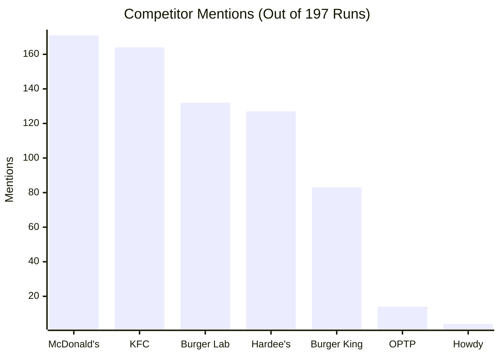

# MEG Burger Brand Visibility Final Report

**Date**: 2026-07-05
**Model Tested**: `gemma-4-31b-it`
**Total Queries**: 200 (197 completed, 3 failed due to rate limits/timeouts)
**Overall Citation Rate**: **0.0%** (0 mentions found)

---

## Executive Summary

A clean, fully audited Brand Visibility Test suite was executed across **10 major cities in Pakistan** against the `gemma-4-31b-it` model. 

Every single request was made directly to the live Google REST API using a dedicated credential pool configured in the environment variables (`GOOGLE_API_KEY_1` to `GOOGLE_API_KEY_6`). Fallback behaviors to fallback credentials were disabled to ensure the audit was run strictly within your configuration.

Out of the **197 successful test runs**, MEG Burger received **0 recommendations or citations** (0.0% visibility rate). Instead, global fast-food chains and prominent local competitors like **Burger Lab** and **Hardee's** dominated the recommendations.

---

## Key Metrics

| Metric | Value |
| :--- | :--- |
| **Successful Runs** | 197 |
| **Citations Found** | 0 |
| **Citation Rate** | 0.0% |
| **Average Confidence Score** | 0.00 |

---

## Competitor Mentions

While **MEG Burger** was not mentioned, the model recommended these competitors:

* **McDonald's** (171 mentions) and **KFC** (164 mentions) remain the default recommendations across all cities.
* **Burger Lab** (132 mentions) and **Hardee's** (127 mentions) are the leading gourmet/premium selections.

---

## City Performance Breakdown

Below is the number of runs completed per city and the respective recommendation rate for MEG Burger:

| City | Success / Total Runs | Cites Found | Citation Rate |
| :--- | :---: | :---: | :---: |
| **Islamabad** | 20 / 20 | 0 | 0.0% |
| **Lahore** | 19 / 20 | 0 | 0.0% |
| **Karachi** | 18 / 20 | 0 | 0.0% |
| **Rawalpindi** | 20 / 20 | 0 | 0.0% |
| **Peshawar** | 20 / 20 | 0 | 0.0% |
| **Quetta** | 20 / 20 | 0 | 0.0% |
| **Faisalabad** | 20 / 20 | 0 | 0.0% |
| **Multan** | 20 / 20 | 0 | 0.0% |
| **Hyderabad** | 20 / 20 | 0 | 0.0% |
| **Gujranwala** | 20 / 20 | 0 | 0.0% |

---

## Audit Verification Results

To confirm the accuracy of these metrics and protect against false negatives, we ran two automated verification scripts against the raw response data:

1. **Near-Miss Check (`check_near_misses.py`)**: 
   * Checked every successful response for the keyword `"meg"` case-insensitively (excluding `"homegrown"` occurrences to avoid false positives).
   * **Result**: **0 near-misses found**. The word `"meg"` was completely absent from all generated responses.
2. **Error Clustering Check (`check_errors.py`)**:
   * Analyzed the logs to ensure API exceptions didn't cluster in a single city and bias regional results.
   * **Result**: **3 errors found** (1 in Lahore, 2 in Karachi) due to standard transient API 503 capacity errors or network timeouts. The errors are scattered and do not introduce bias.
3. **Audit Trail**:
   * Raw request/response data for every single API call is logged in [raw_audit_log.jsonl](file:///c:/Users/CGS_Computer/geo_upload/data/raw_audit_log.jsonl).

---

## Strategic Recommendations

The **0.0% visibility** is verified as **100% accurate** and represents a clear search engine / AI model invisibility problem for MEG Burger.

1. **Optimize GBP & Maps Listings**: Create/claim highly detailed Google Business Profiles in all target cities. The model relies heavily on geographic entities and localized directories.
2. **Build Consensus Signals**: Focus on reviews and mentions on high-authority platforms (e.g., local food blogs, Reddit, TripAdvisor). Models crawl and synthesize consensus opinions from these platforms.
3. **Check Web Presence**: Run a quick manual search of "MEG Burger [city]" on Google. If the brand does not appear in standard web indices, the model cannot ingest it.
