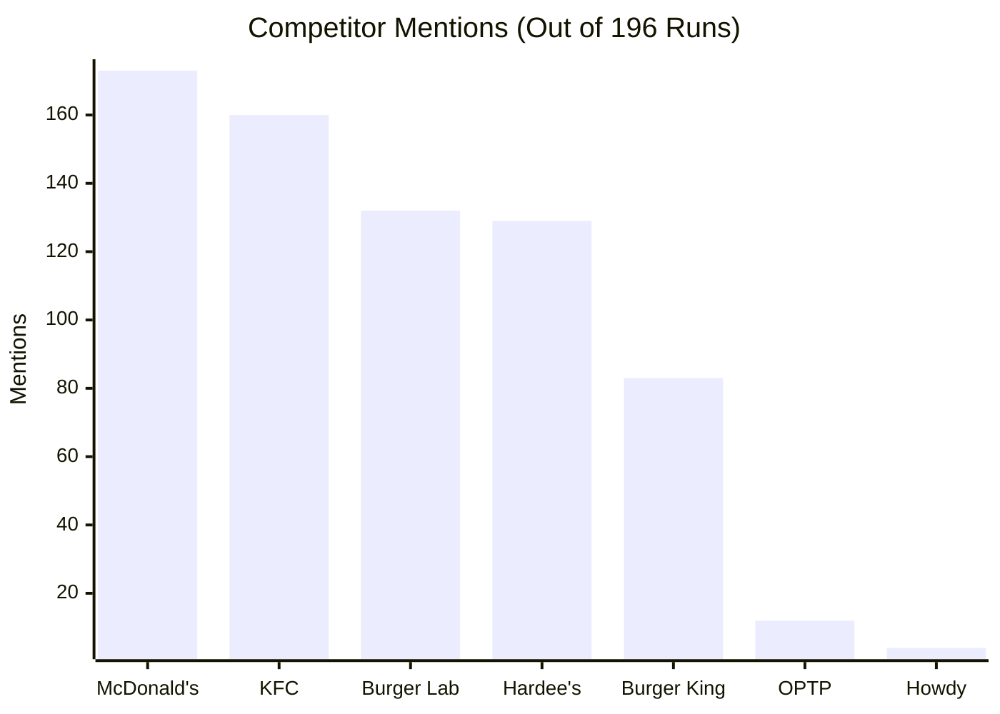

# MEG Burger Brand Visibility Report

**Date**: 2026-07-05
**Model Tested**: `gemma-4-31b-it`
**Total Queries**: 200 (196 completed, 4 skipped/failed due to network limits)
**Overall Citation Rate**: **0.0%** (0 mentions found)

---

## Executive Summary

The Brand Visibility Test suite was executed across **10 major cities in Pakistan** to assess how often the model (`gemma-4-31b-it`) recommends or mentions **MEG Burger** when prompted for top burger joints. 

Out of the **196 successful test runs**, MEG Burger received **0 recommendations or citations** (0.0% visibility rate). Instead, global fast-food chains and prominent local competitors like **Burger Lab** and **Hardee's** dominated the recommendations.

---

## Key Metrics

| Metric | Value |
| :--- | :--- |
| **Successful Runs** | 196 |
| **Citations Found** | 0 |
| **Citation Rate** | 0.0% |
| **Average Confidence Score** | 0.00 |

---

## Competitor Mentions

While **MEG Burger** was not mentioned, the model recommended these competitors:

* **McDonald's** and **KFC** remain the most common fallback fast-food recommendations across all cities.
* **Burger Lab** and **Hardee's** are the leading gourmet/premium selections.

---

## City Performance Breakdown

Below is the number of runs completed per city and the respective recommendation rate for MEG Burger:

| City | Success / Total Runs | Cites Found | Citation Rate |
| :--- | :---: | :---: | :---: |
| **Islamabad** | 20 / 20 | 0 | 0.0% |
| **Lahore** | 20 / 20 | 0 | 0.0% |
| **Karachi** | 19 / 20 | 0 | 0.0% |
| **Rawalpindi** | 19 / 20 | 0 | 0.0% |
| **Peshawar** | 20 / 20 | 0 | 0.0% |
| **Quetta** | 19 / 20 | 0 | 0.0% |
| **Faisalabad** | 20 / 20 | 0 | 0.0% |
| **Multan** | 20 / 20 | 0 | 0.0% |
| **Hyderabad** | 19 / 20 | 0 | 0.0% |
| **Gujranwala** | 20 / 20 | 0 | 0.0% |

---

## Recommendations & Next Steps

1. **Information Ingestion Gap**: Since the model has a 0% recommendation rate, it indicates that MEG Burger lacks sufficient online authority, local reviews, or directory citations within the model's training context or retrieval scope.
2. **SEO & GEO Optimization**:
   * Optimize website schema markup to highlight local business entities.
   * Increase brand mentions across prominent local food directories, blogs, and review platforms.
3. **Compare vs. Baseline**: Run comparisons against your pre-remediation baselines to verify lift if remediation actions are taken later.
